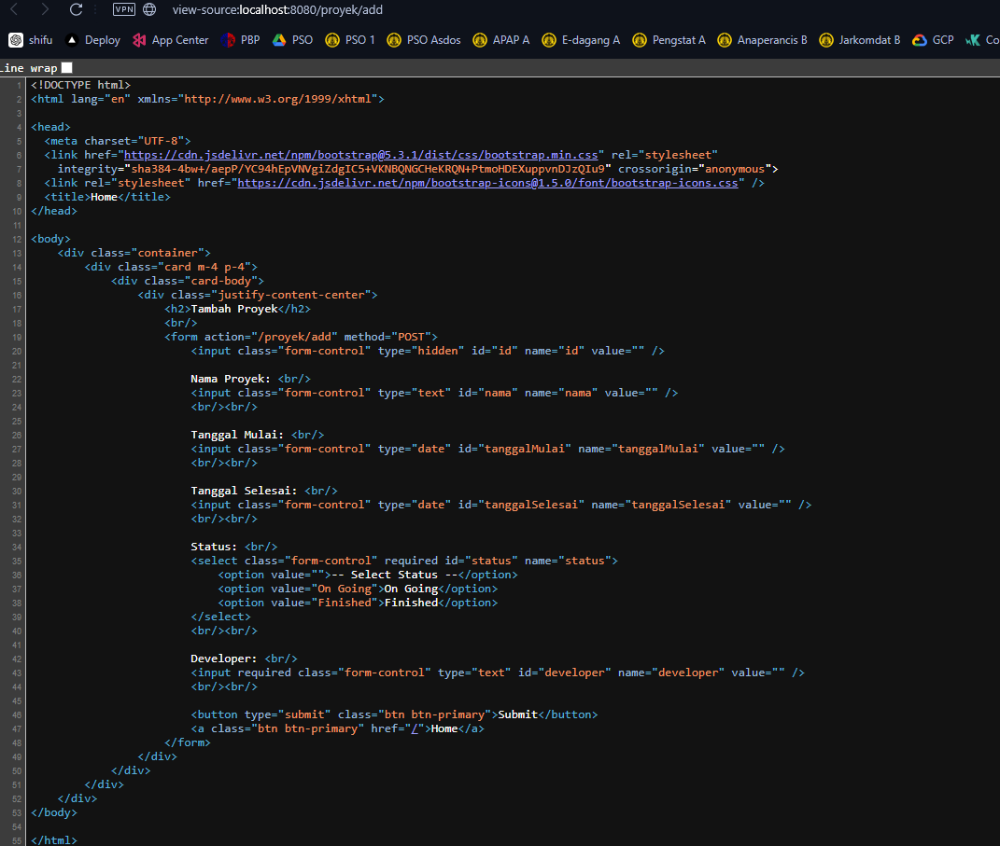
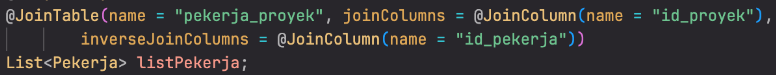

# Tutorial APAP

## Authors

* **Clement Samuel Marly** - *2206082114* - *A* 

[Tutorial 1](#tutorial-1)

[Tutorial 2](#tutorial-2)

[Tutorial 3](#tutorial-3)

---
## Tutorial 1
### Apa yang telah saya pelajari hari ini
1. Hal pertama yang saya pelajari adalah cara kerja gitlab itu sendiri. Meskipun tidak berbeda jauh dengan github, tetapi di dalam tutorial diajarkan cara menggunakan gitlab yang lebih terstruktur dengan bagian administrasi yang lebih detil.
2. Cara kerja *framework* Springboot dengan strukturnya yang *Model-View-Controller*. Berbeda dengan Django, *framework* Springboot menggunakan bahasa java dan memiliki struktur yang berbeda.

### Pertanyaan

### GitLab
1. **Apa itu Issue Tracker? Apa saja masalah yang dapat diselesaikan dengan Issue Tracker?**

   **Issue Tracker** adalah sebuah alat atau sistem yang digunakan untuk mencatat, melacak, dan mengelola masalah (issue) atau tugas yang muncul dalam suatu proyek pengembangan perangkat lunak. Issue Tracker membantu tim pengembang berkomunikasi tentang bug, fitur yang diinginkan, peningkatan, atau tugas-tugas lain dalam siklus pengembangan. Alat ini membantu memprioritaskan pekerjaan, memastikan tugas dikerjakan, dan memberikan gambaran kemajuan proyek secara keseluruhan.

   Masalah yang dapat diselesaikan dengan Issue Tracker:
   - Bug Tracking: Melacak bug dan error dalam aplikasi.
   - Feature Requests: Menangani permintaan fitur baru dari pengguna atau tim.
   - Progress Monitoring: Memantau perkembangan tugas dalam proyek.

2. **Saat membuat Merge Request, terdapat 2 merge options yang diceklis. Jelaskan fungsi dari kedua pilihan tersebut!**

   **Delete source branch when merge request is accepted**:
   Opsi ini akan secara otomatis menghapus branch sumber (branch yang membuat perubahan) setelah Merge Request berhasil diterima dan digabungkan ke branch target (biasanya branch utama seperti main atau master).

   **Squash commits when merge request is accepted**:
   Opsi ini akan menggabungkan semua commit yang ada dalam Merge Request menjadi satu commit tunggal ketika Merge Request digabungkan. Ini menggabungkan semua commit tanpa mengubahnya, jadi commit history akan mempertahankan setiap perubahan yang dibuat.

   **Mengapa hanya Squash yang diceklis?**

   Squash membuat riwayat commit menjadi lebih sederhana dan rapi, terutama untuk fitur atau bug kecil. Dengan Squash, commit tidak dipenuhi oleh banyak commit kecil, yang dapat mempersulit pemahaman history proyek.

3. **Apa keunggulan menggunakan Version Control System seperti Git dalam pengembangan suatu aplikasi?**
   - Kolaborasi: Git memungkinkan banyak pengembang bekerja pada proyek yang sama secara bersamaan tanpa mengganggu pekerjaan satu sama lain.
   - Version History: Setiap perubahan pada kode disimpan, sehingga dapat dilacak siapa yang melakukan perubahan apa dan kapan.
   - Branching dan Merging: Pengembang dapat membuat cabang (branch) untuk fitur atau bug fix, lalu menggabungkannya kembali (merge) ke dalam cabang utama setelah selesai.
   - Backup: Dengan Git, kode proyek selalu tersimpan dan dapat dipulihkan jika terjadi kesalahan.
   - Distributed Version Control: Setiap pengembang memiliki salinan lengkap dari seluruh riwayat proyek di komputer mereka, membuat pengembangan lebih fleksibel.

### Spring
4. **Apa itu library & dependency?**
   
   **Library**: Sebuah library adalah kumpulan kode yang telah ditulis sebelumnya dan disusun dalam satu paket untuk digunakan kembali dalam pengembangan perangkat lunak. Library berisi fungsi atau modul yang dapat digunakan untuk menyederhanakan tugas tertentu sehingga tidak perlu menulis ulang fungsi tersebut.

   **Dependency**: Dependency adalah hubungan antara proyek dengan library atau framework eksternal yang digunakan dalam proyek tersebut. Ketika suatu proyek memerlukan kode atau fungsionalitas dari library lain, library itu disebut sebagai dependency proyek. Dependency ini dikelola oleh dependency manager, seperti Gradle atau Maven, untuk memastikan library yang tepat dan versi yang kompatibel digunakan.

5. **Apa itu Gradle?**

   **Gradle**: Gradle adalah alat *build automation tool* yang berbasis bahasa pemrograman Groovy atau Kotlin. Gradle digunakan untuk mengelola proses build, dependency, pengujian, dan pengemasan aplikasi. Ini mendukung pengembangan proyek Java, Android, dan bahasa lain.

   **Mengapa kita menggunakan Gradle?**

   Gradle menyediakan proses build yang cepat dan efisien, mendukung cache, serta mengurangi waktu pengujian dengan memanfaatkan paralelisme. Gradle juga memberikan fleksibilitas dalam mengelola dependency, sehingga proyek dapat mengimpor library dan framework dengan mudah. Terakhir, Gradle memungkinkan pengaturan multi-proyek dengan struktur yang lebih sederhana.

   **Alternatif dari Gradle:**
   
   - **Maven**: Maven adalah alat build yang lebih tua dan digunakan secara luas dalam ekosistem Java.
   
   - **Ant**: Ant adalah alat build lebih sederhana tetapi tidak memiliki pengelolaan dependency secara otomatis seperti Maven atau Gradle.

6. **Apa perbedaan dari @RequestParam dan @PathVariable?**

   - **@RequestParam**: Digunakan untuk mengekstrak parameter kueri dari URL. Parameter kueri adalah bagian dari URL yang biasanya muncul setelah tanda tanya (?). Misalnya, dalam URL http://example.com/users?name=Clement, parameter name bisa diambil dengan menggunakan @RequestParam.

   Contoh: @RequestParam("name") String name

   - **@PathVariable**: Digunakan untuk mengambil variabel yang merupakan bagian dari URL path itu sendiri. Misalnya, dalam URL http://example.com/users/123, angka 123 bisa diambil sebagai variabel dengan menggunakan @PathVariable.

   Contoh: @PathVariable("id") Long id

7. **Apa itu DTO?**

   **DTO** (Data Transfer Object) adalah objek sederhana yang digunakan untuk mentransfer data antar lapisan dalam suatu aplikasi, seperti antara lapisan layanan (service) dan lapisan presentasi (controller). DTO biasanya hanya berisi properti getter dan setter tanpa ada logika program. Tujuan utama DTO adalah untuk mengemas data dan menjaga keamanan atau abstraksi.

   **Apakah DTO harus selalu digunakan?**
   DTO tidak selalu harus digunakan, tergantung pada kompleksitas dan kebutuhan aplikasi. Dalam aplikasi yang sederhana, data yang ditransfer tidak terlalu banyak dan strukturnya tidak berubah-ubah sehingga penggunaan DTO mungkin tidak diperlukan. Namun, penggunaan DTO sangat dianjurkan dalam aplikasi yang lebih kompleks atau dalam lingkungan enterprise.

   **Kapan sebaiknya kita menggunakan DTO?**
   - Ketika berkomunikasi antar layer: Terutama jika aplikasi menggunakan arsitektur seperti MVC (Model-View-Controller) dimana data perlu dipisahkan secara jelas antara lapisan domain dan presentasi.
   - Menghindari over-fetching atau under-fetching data: Dengan DTO, kita bisa memastikan hanya data yang diperlukan yang dikirim ke klien atau antara layanan, sehingga menghindari pengiriman data yang berlebihan atau kurang.
   Ketika data yang dikirim atau diterima berbeda dari entitas domain: Dalam kasus di mana data yang dibutuhkan oleh klien berbeda dengan model data internal (entitas), DTO dapat digunakan untuk mengonversi data sesuai dengan kebutuhan klien tanpa mengubah entitas.
   - Keamanan dan privasi: Ketika kita perlu mencegah data sensitif dari entitas domain bocor ke pihak luar. DTO dapat digunakan untuk menyembunyikan properti tertentu.

8. **Jelaskan bagaimana alur ketika kita menjalankan http://localhost:8080/roman-converter/MMXXIV sampai dengan muncul keluarannya di browser!**
   - **Request**: 
Browser mengirimkan permintaan GET ke URL http://localhost:8080/roman-converter/MMXXIV.
   - **Controller**:
Spring Boot akan mencari endpoint yang sesuai dengan request URL ini.
Pada class RomanConverterController, ada method romanConverterWithPathVariable(@PathVariable("roman") String roman, Model model), yang cocok dengan path /roman-converter/{roman}. Nilai MMXXIV akan disimpan dalam variabel roman.
   - **Validation**:
Di dalam method romanConverterWithPathVariable, program akan memeriksa apakah nilai roman adalah bilangan Romawi yang valid menggunakan method isValidRomanNumeral().
Jika valid, string MMXXIV akan dikirim ke method getRomanConverterPage(String roman, Model model).
   - **Processing**:
Di dalam method getRomanConverterPage(), objek RomanConverter akan dibuat menggunakan new RomanConverter(roman).
Konversi dilakukan di dalam objek RomanConverter, dan hasilnya disimpan dalam model dengan nama romanConverter.
   - **View Rendering**:
Spring Boot akan mengembalikan view dengan nama view-conversion-result.html.
Pada view ini, data yang dimasukkan ke dalam model (hasil konversi bilangan Romawi) akan ditampilkan di browser.

9. **Jelaskan bagaimana alur ketika kita menjalankan http://localhost:8080/roman-converter?roman=MMXXIV sampai dengan muncul keluarannya di browser!**
   - **Request**: 
Browser mengirimkan permintaan GET ke URL http://localhost:8080/roman-converter?roman=MMXXIV.
   - **Controller**:
Spring Boot akan mencari endpoint yang cocok dengan query parameter ini.
Pada RomanConverterController, ada method romanConverterWithReqParam(@RequestParam("roman") String roman, Model model), yang cocok dengan request URL yang memiliki parameter query roman=MMXXIV.
Nilai MMXXIV akan diambil dari query parameter dan dimasukkan ke variabel roman.
   - **Validation**:
Di dalam method romanConverterWithReqParam, program akan memeriksa apakah nilai roman valid menggunakan method isValidRomanNumeral().
Jika valid, string MMXXIV akan diteruskan ke method getRomanConverterPage().
   - **Processing**:
Di dalam method getRomanConverterPage(), objek RomanConverter dibuat untuk melakukan konversi bilangan Romawi ke desimal.
Hasilnya dimasukkan ke dalam model.
   - **View Rendering**:
Spring Boot akan mengembalikan view dengan nama view-conversion-result.html.
Pada view ini, hasil konversi bilangan Romawi akan ditampilkan di browser.

10. **Jelaskan bagaimana alur ketika kita menjalankan http://localhost:8080/convert sampai dengan muncul keluarannya di browser!**
    - **Request**: 
Browser mengirimkan permintaan GET ke URL http://localhost:8080/convert.
    - **Controller**:
Spring Boot mencari endpoint yang sesuai. Pada RomanConverterController, ada method getRomanCoverterWithView(Model model), yang cocok dengan path /convert.
Dalam method ini, sebuah objek RequestDTO dibuat dan disimpan ke dalam model.
    - **View Rendering (Form)**:
Spring mengembalikan view form.html, yang merupakan halaman form untuk memasukkan bilangan Romawi.
Di halaman ini, user diminta untuk memasukkan bilangan Romawi yang ingin dikonversi, dan form ini menggunakan POST method untuk submit data.
    - **Form Submission**:
Setelah user mengisi form dan menekan tombol "Convert", permintaan POST akan dikirim ke URL http://localhost:8080/convert.
Spring mencari endpoint yang sesuai dengan POST request ini. Pada RomanConverterController, method postRomanConverterWithView(@ModelAttribute RequestDTO requestDTO, Model model) cocok dengan permintaan ini.
    - **Validation and Processing**:
Dalam method postRomanConverterWithView, nilai dari form yang dikirim (bilangan Romawi) diambil dari objek RequestDTO.
Bilangan Romawi ini kemudian diperiksa apakah valid menggunakan isValidRomanNumeral().
Jika valid, objek RomanConverter dibuat dan hasil konversi disimpan ke dalam model.
    - **View Rendering (Result)**:
Spring akan mengembalikan view view-conversion-result.html yang menampilkan hasil konversi.

11. **Pada Tutorial 1 - Panduan bagian Spring Boot > VS Code / IDE > langkah 4, kita mendapati error. Apa penyebabnya?**

    Error 404 (Not Found) dalam konteks aplikasi Spring Boot biasanya terjadi ketika Spring tidak dapat menemukan resource yang diminta oleh pengguna. Hal ini dikarenakan belum adanya resource yang sesuai di project (template html belum ada pada bagian bagian Spring Boot > VS Code / IDE > langkah 4).

---

## Tutorial 2
### Apa yang telah saya pelajari hari ini
1. DTO tidak perlu digunakan dalam sebuah proyek, tetapi sebaiknya digunakan.
2. Penyimpanan data dapat dilakukan dengan membuat sebuah metode di DTO atau dapat diatur secara manual di controller dengan setter getter.
3. Setter, getter, dan constructor dapat dibuat secara otomatis melalui source action.

### Pertanyaan

1. **Jelaskan kegunaan DTO pada proyek ini? Apakah bisa jika sebuah proyek tidak menggunakan DTO sama sekali?**

   ***Data Transfer Object*** atau disingkat DTO adalah desain dari SpringBoot yang memungkinkan kkomunikasi data efisien dari berbagai layer di dalam proyek. DTO sendiri bekerja dengan cara agregasi data menjadi sebuah objek untuk mengurangi jumlah pemanggilan method di dalam proyek. Hal ini meningkatkan efisiensi proyek sekaligus meningkatkan modularitas dari proyek.
   Dalam proyek ini, DTO digunakan untuk menghubungkan Controller dengan Model proyek. Melalui DTO, pemanggilan method-method dari Proyek dapat dilakukan. Salah satu contoh penggunaannya adalah sebagai berikut dimana DTO digunakan di dalam Controller untuk menghubungkan dengan model.

   ```java
   @PostMapping("/proyek/add")
    public String addProyek(@ModelAttribute ProyekDTO proyekDTO, Model model) {
        if (proyekDTO.getTanggalMulai().after(proyekDTO.getTanggalSelesai())) {
            return "wrong-date-input"; 
        }
        UUID idProyek = UUID.randomUUID();
        var proyek = new Proyek(idProyek, proyekDTO.getNama(), proyekDTO.getTanggalMulai(),
                proyekDTO.getTanggalSelesai(), proyekDTO.getStatus(), proyekDTO.getDeveloper());
        proyekService.createProyek(proyek);
        model.addAttribute("id", proyek.getId());
        model.addAttribute("Nama", proyek.getNama());

        return "success-add-proyek";
    }
    ```
    Sebuah proyek bisa berjalan tanpa menggunakan DTO (seperti proyek ini apabila disesuaikan), tetapi terdapat beberapa kekurangan yang perlu diperhatikan apabila tidak menggunakan DTO, seperti kurangnya keamanan, separasi, validasi, dan modularitas. Hal ini menyebabkan DTO tetap disarankan untuk digunakan.

Sumber: [DTO medium](https://medium.com/@vishamberlal/understanding-data-transfer-objects-dto-in-spring-boot-ac06b575a1d5#:~:text=Data%20Transfer%20Objects%20play%20a,and%20enhance%20versioning%20and%20compatibility.)

2. **Apa itu UUID? Mengapa UUID digunakan? Pada proyek ini, UUID digunakan sebagai apa?**
   **UUID** atau **Universal Unique Identifier** adalah value sebesar 128-bit yang digunakan secara universal dalam mengidentifikasi objek atau entity. UUID di-*generate* dan di-*assign* ke sebuah objek agar bisa diidentifikasi dan dibedakan dengan objek lain. UUID juga sering digunakan agar sebuah objek bisa dicari. 

   Pada proyek ini, UUID digunakan sebagai id dari tiap proyek. Setiap kali proyek dibuat, UUID baru akan di-*generate* sehingga setiap proyek akan memiliki identifier untuk membedakan satu proyek dengan lainnya. UUID ini kemudian juga digunakan agar sebuah proyek dapat dicari dan diidentifikasi apabila ingin diubah. Contohnya dapat dilihat pada snippet kode berikut dari proyek yang menggunakan UUID untuk mencari proyek yang memiliki UUID yang sama:
   ```java
   @Override
    public Proyek getProyekById(UUID id){
        for (Proyek proyek : listProyek){
            if (proyek.getId().equals(id)){
                return proyek;
            }
        }
        return null;
    }
   ```
   
Sumber: [UUID Tech Target](https://www.techtarget.com/searchapparchitecture/definition/UUID-Universal-Unique-Identifier)
   
3. **Pada service, mengapa perlu ada pemisahan antara interface dan implementasinya? Apa keuntungan pemisahan tersebut?**
Pemisahan antara interface dan implementasinya memberikan beberapa keuntungan apabila dipisahkan. Hal ini tidak berbeda jauh dengan konsep pemisahan logika bisnis dan logika aplikasi. Berikut adalah beberapa keuntungan tersebut:
   - **Abstraksi:**
Interface bertindak sebagai kontrak yang mendefinisikan apa saja metode yang harus diimplementasikan tanpa memperhatikan bagaimana metode tersebut diimplementasikan. Ini membantu mendefinisikan perilaku yang diharapkan dari service secara abstrak.
Dengan memiliki interface, dapat dipastikan bahwa setiap class yang mengimplementasikan interface ini memiliki metode yang sama.
   - **Dependency Injection dan Inversi Kendali (IoC):**
Melalui pemisahan interface dan implementasi, SpringBoot dapat melakukan Dependency Injection yang sesuai ke dalam komponen yang memerlukannya tanpa harus bergantung langsung pada class implementasi tertentu. Ini kemudian dapat digunakan untuk memudahkan pendefinisikan dependensi menggunakan interface.
   - **Polimorfisme dan Testing:**
Polimorfisme memungkinkan untuk mengganti implementasi service dengan mudah selama mengikuti kontrak yang ditentukan oleh interface. Hal ini sangat berguna dalam testing, dimana bisa menggunakan mock untuk menggantikan implementasi asli dalam pengujian unit.

Sumber: 
[Medium: Understanding Spring Boot: Services, Components, and Repositories](https://medium.com/@shybham36/understanding-spring-boot-services-components-and-repositories-0a6f456ff6d6)
[StackOverflow: Purpose of Service Interface Class in Spring Boot](https://stackoverflow.com/questions/62599259/purpose-of-service-interface-class-in-spring-boot)

4. **Menurut kamu anotasi @Autowired pada class Controller tersebut merupakan implementasi dari konsep apa? Dan jelaskan secara singkat cara kerja @Autowired tersebut dalam konteks service dan controller yang telah kamu buat.**
Anotasi `@Autowired` di dalam kelas Controller merupakan implementasi dari konsep *Dependency Injection* dan *Inversion of Control* SpringBoot. @Autowired digunakan untuk secara otomatis menyuntikkan (inject) dependency atau komponen yang dibutuhkan oleh sebuah objek tanpa harus membuat instance dari dependency tersebut secara manual. Controller tidak perlu secara langsung membuat instance dari service yang dibutuhkannya, tetapi SpringBoot yang akan melakukannya.
Cara Kerja @Autowired:
- Deklarasi Dependency: Pada class Controller, ada dependency ke service yang dideklarasikan melalui constructor atau field dengan anotasi @Autowired.
```java
@Autowired
public ProyekController(ProyekService proyekService) {
    this.proyekService = proyekService;
}
```
- Pencarian dan Penyuntikan Dependency: Ketika SpringBoot menjalankan aplikasi, IoC Container akan melakukan pencarian bean yang cocok di dalam aplikasi yang telah dibuat dan mengelola siklus hidup bean tersebut.
SpringBoot kemudian mencari bean yang bertipe ProyekService (misalnya, ProyekServiceImpl) di dalam container dan akan menyuntikkan bean tersebut ke dalam field atau constructor yang telah ditandai dengan anotasi @Autowired.
- Penggunaan Dependency: Setelah ProyekService disuntikkan ke dalam ProyekController, service tersebut dapat digunakan dalam metode-metode di controller untuk menjalankan logika bisnis aplikasi.

Sumber: [PWSills: What is The Use of @Autowired in Spring Boot?](https://pwskills.com/blog/autowired-in-spring-boot/#:~:text=Spring%20Boot%20applications%3F-,Autowired%20Meaning,and%20configuration%20of%20application%20objects.)


5. **Apa perbedaan @GetMapping dan @PostMapping? Kapan @GetMapping dan @PostMapping digunakan?**
   - **@GetMapping**
      - @GetMapping digunakan untuk menangani HTTP GET request. GET biasanya digunakan untuk membaca atau mengambil data dari server, tanpa mengubah data di server.
      - @GetMapping digunakan ketika kita ingin mengambil atau menampilkan data. Contoh: Mengambil spesifikasi proyek, menampilkan daftar produk, dll.
   - **@PostMapping**
      - @PostMapping digunakan untuk menangani HTTP POST request. POST biasanya digunakan untuk mengirimkan data ke server, seperti membuat atau memperbarui data di server.
      - @PostMapping digunakan ketika kita ingin mengirim data untuk disimpan atau diproses lebih lanjut. Contoh: Menambahkan data proyek baru, memperbarui profil pengguna, dll.
Sumber: [GFG Spring – @PostMapping and @GetMapping Annotation](https://www.geeksforgeeks.org/spring-postmapping-and-getmapping-annotation/)


6. **Apakah terdapat jenis mapping lain yang dapat digunakan? Jelaskan minimal 3 jenis mapping lain!**
   - **@PutMapping**
      - Anotasi ini digunakan untuk menangani HTTP PUT request. PUT biasanya digunakan untuk memperbarui atau mengganti data yang sudah ada pada server. 
      - Digunakan untuk mengupdate data resource yang sudah ada dengan data baru yang lengkap.
   - **@DeleteMapping**
      - Anotasi ini digunakan untuk menangani HTTP DELETE request. DELETE digunakan untuk menghapus resource yang ada di server.
      - Digunakan untuk menghapus resource tertentu berdasarkan ID atau kriteria lainnya dari server.
   - **@PatchMapping**
      - Anotasi ini digunakan untuk menangani HTTP PATCH request. PATCH biasanya digunakan untuk memperbarui sebagian dari resource (partial update), mengubah hanya sebagian atribut tanpa mengganti keseluruhan data.
      - Digunakan untuk mengupdate sebagian data dari resource yang sudah ada.

Sumber: [Java Guides Spring @GetMapping, @PostMapping, @PutMapping, @DeleteMapping and @PatchMapping](https://www.javaguides.net/2018/11/spring-getmapping-postmapping-putmapping-deletemapping-patchmapping.html)


7. **Jelaskan proses yang terjadi di controller, model, dan service pada proses create proyek, mulai dari fungsi addFormProyek hingga pengguna menerima halaman success-add-proyek.**
   1. Pengguna mengakses halaman form melalui controller (addProyekForm).
      - Saat pengguna mengakses URL /proyek/add, method addProyekForm() dipanggil.
      - Sebuah ProyekDTO kosong dikirim ke view (Thymeleaf template) agar bisa digunakan sebagai model attribute.
      - Pengguna kemudian melihat halaman form untuk mengisi detail proyek.
   2. Pengguna mengisi form dan mengirimkan data. Controller menerima data melalui method POST (addProyek).
      - Saat form dikirimkan, method addProyek() dipanggil dengan data dari form yang dipetakan ke ProyekDTO.
      - Sebuah ID proyek unik (UUID) dihasilkan untuk proyek baru.
      - Data dari DTO diubah menjadi entitas Proyek yang berisi data proyek, termasuk nama, tanggal mulai, tanggal selesai, status, dan developer.
      - Method `proyekService.createProyek()` dipanggil untuk menyimpan proyek baru ke dalam aplikasi.
   3. Controller memanggil service untuk membuat proyek baru dan menyimpan data tersebut.
      - Ketika `createProyek()` dipanggil dari controller, service menambahkan proyek baru ke dalam list proyek (listProyek).
   4. Service menyimpan proyek ke dalam list.
   5. Controller mengarahkan pengguna ke halaman success-add-proyek dan menampilkan detail proyek yang baru dibuat.

Sumber: [GFG How Spring Boot Application Works Internally?](https://www.geeksforgeeks.org/how-spring-boot-application-works-internally/)

8. **Jelaskan mengenai th:object!**
`th:object` di Thymeleaf digunakan untuk mengikat sebuah model object ke suatu HTML form sehingga memungkinkan untuk memetakan data input dari HTML ke objek Java di backend. Dengan `th:object`, Thymeleaf memberikan kemampuan otomatis untuk mengisi nilai pada field form yang sesuai dengan properti dari objek tersebut serta memungkinkan pengiriman data dari form kembali ke controller. Jika objek yang dikirim dari backend memiliki nilai, `th:object` juga memungkinkan form untuk di-*pre-fill* dengan data dari objek tersebut. Hal ini berguna saat meng-*update* data dimana field form akan secara otomatis terisi dengan nilai yang ada pada objek.
Contoh penggunaan: `th:object="${proyekDTO}"` Mengikat form HTML dengan objek proyekDTO yang dikirimkan dari controller.

Sumber: [Thymeleaf: Thymeleaf Tutorial](https://www.thymeleaf.org/doc/tutorials/2.1/thymeleafspring.html)

9. **Jelaskan mengenai th:field!**
`th:field` adalah atribut yang digunakan di Thymeleaf untuk menghubungkan elemen input HTML seperti input dengan properti dari objek yang dikirimkan oleh controller. Fungsinya adalah untuk secara otomatis memetakan data yang diisi dalam form HTML ke properti objek Java sehingga ketika form dikirim (submit), nilai-nilai input dapat dipetakan langsung ke objek di backend. Sama dengan `th:object`, `th:field` dapat digunakan juga untuk *pre-fill* data di HTML.
Berdasarkan gambar page source url http://localhost:8080/proyek/add, berikut adalah penjelasan HTML dengan `th:field`:

   - Nama Proyek: Input text untuk nama proyek, dengan name="nama" dan id="nama". Ini di-bind dengan th:field="*{nama}", yang berarti data dari input ini akan dipetakan ke properti nama di objek ProyekDTO.
   - Tanggal Mulai & Tanggal Selesai: Kedua field ini merupakan input bertipe date, yang di-bind ke properti tanggalMulai dan tanggalSelesai pada objek ProyekDTO.
   - Status: Dropdown yang di-bind ke properti status di ProyekDTO, dengan dua pilihan, yaitu "On Going" dan "Finished". Pilihan "-- Select Status --" disediakan untuk memvalidasi input kosong.
   - Developer: Input text untuk developer, yang juga di-bind ke properti developer.

Sumber: [Thymeleaf: Thymeleaf Tutorial](https://www.thymeleaf.org/doc/tutorials/2.1/thymeleafspring.html)

10. **Apakah terdapat jenis “th” lainnya? Jelaskan minimal 3 jenis “th” lainnya yang kamu temukan!**
   - `th:text`
   Digunakan untuk menampilkan teks dinamis di dalam elemen HTML. th:text menggantikan konten teks statis di antara tag HTML dengan nilai yang disediakan oleh model (misalnya, dari controller Spring).
   Contoh:
   ```html
   <p th:text="${proyek.nama}">Nama Proyek</p>
   ```
   `th:text="${proyek.nama}"` menggantikan teks yang ada di dalam elemen `<p>` dengan nilai properti nama dari objek proyek.

   - `th:href`
   Digunakan untuk mengatur nilai atribut href dari elemen anchor `<a>` secara dinamis. Atribut ini biasanya digunakan untuk membuat link yang dinamis.
   Contoh:
   ```html
   <a th:href="@{/proyek/view/{id}(id=${proyek.id})}">Lihat Proyek</a>
   ```
Tautan ini akan mengarahkan pengguna ke URL /proyek/view/{id}, di mana {id} akan digantikan dengan proyek.id dari model.

   - `th:if dan th:unless`
   Digunakan untuk menyembunyikan atau menampilkan elemen HTML berdasarkan kondisi logis. th:if menampilkan elemen jika kondisinya true, sedangkan th:unless menampilkan elemen jika kondisinya false.
   Contoh:
   ```html
   <div th:if="${proyek.status == 'Finished'}">
      Proyek ini telah selesai.
   </div>
   <div th:unless="${proyek.status == 'Finished'}">
      Proyek ini belum selesai.
   </div>
   ```
Elemen `<div>` hanya akan ditampilkan jika status proyek adalah "Finished" atau bukan "Finished"

Sumber: [Thymeleaf: Thymeleaf Tutorial](https://www.thymeleaf.org/doc/tutorials/2.1/thymeleafspring.html)

---

## Tutorial 3
### Apa yang telah saya pelajari hari ini
1. Fungsi Lombok sebagai sebuah library untuk getter, setter, dan lainnya.
2. Cara menghubungkan database dengan proyek melalui docker dan melihatnya melalui dbeaver.

### Pertanyaan
1. **Jelaskan seluruh configuration properties (application, datasource, jpa) yang terdapat di dalam file application.yml!**
2. **Pada tutorial ini, kita menggunakan docker container untuk membentuk database. Apa keuntungan menggunakan docker container dibandingkan tanpa menggunakannya?**
3. **Jelaskan secara singkat apa itu dan kegunaan dari annotation dibawah ini
(@Entity, @Table, @Column)**
4. **Pada model, kita dapat menentukan relasi antarmodel dengan menggunakan JPA Annotation. Sebutkan seluruh JPA Annotation yang dapat digunakan untuk mendefinisikan relasi antarmodel beserta perbedaannya!**
5. **Pada model Proyek, terdapat annotation @JoinTable seperti berikut**

**Jelaskan kegunaan annotation tersebut beserta seluruh parameternya!**
6. **Jelaskan mengapa kita harus membentuk JPA Repository!
Sebutkan beberapa alternatif dari Java Faker!**

### Apa yang belum saya pahami
- [x] Kenapa saya menggunakan Lombok? 
   Untuk menggunakan berbagai metode dari library Lombok tanpa harus membuat kode berlebih.
- [ ] Cara testing ?
- [x] Apakah if else di html itu optimal?
   Bisa, tetapi lebih baik apabila tidak ada.
- [x] Apakah merge request harus diperbarui setiap push baru?
   Push ke dalam branch yang ingin di merge secara otomatis masuk ke dalam merge request.
