# Tutorial APAP

## Authors

* **Clement Samuel Marly** - *2206082114* - *A* 

[Tutorial 1](#tutorial-1)

[Tutorial 2](#tutorial-2)

[Tutorial 3](#tutorial-3)

[Tutorial 4](#tutorial-4)

[Tutorial 5](#tutorial-5)

[Tutorial 6](#tutorial-6)

[Tutorial 7](#tutorial-7)

[Tutorial 8](#tutorial-8)

---
## Tutorial 1
### Apa yang telah saya pelajari hari ini
1. Hal pertama yang saya pelajari adalah cara kerja gitlab itu sendiri. Meskipun tidak berbeda jauh dengan github, tetapi di dalam tutorial diajarkan cara menggunakan gitlab yang lebih terstruktur dengan bagian administrasi yang lebih detil.
2. Cara kerja *framework* Springboot dengan strukturnya yang *Model-View-Controller*. Berbeda dengan Django, *framework* Springboot menggunakan bahasa java dan memiliki struktur yang berbeda.

### Pertanyaan

### GitLab
1. **Apa itu Issue Tracker? Apa saja masalah yang dapat diselesaikan dengan Issue Tracker?**

   **Issue Tracker** adalah sebuah alat atau sistem yang digunakan untuk mencatat, melacak, dan mengelola masalah (issue) atau tugas yang muncul dalam suatu proyek pengembangan perangkat lunak. Issue Tracker membantu tim pengembang berkomunikasi tentang bug, fitur yang diinginkan, peningkatan, atau tugas-tugas lain dalam siklus pengembangan. Alat ini membantu memprioritaskan pekerjaan, memastikan tugas dikerjakan, dan memberikan gambaran kemajuan proyek secara keseluruhan.

   Masalah yang dapat diselesaikan dengan Issue Tracker:
   - Bug Tracking: Melacak bug dan error dalam aplikasi.
   - Feature Requests: Menangani permintaan fitur baru dari pengguna atau tim.
   - Progress Monitoring: Memantau perkembangan tugas dalam proyek.

2. **Saat membuat Merge Request, terdapat 2 merge options yang diceklis. Jelaskan fungsi dari kedua pilihan tersebut!**

   **Delete source branch when merge request is accepted**:
   Opsi ini akan secara otomatis menghapus branch sumber (branch yang membuat perubahan) setelah Merge Request berhasil diterima dan digabungkan ke branch target (biasanya branch utama seperti main atau master).

   **Squash commits when merge request is accepted**:
   Opsi ini akan menggabungkan semua commit yang ada dalam Merge Request menjadi satu commit tunggal ketika Merge Request digabungkan. Ini menggabungkan semua commit tanpa mengubahnya, jadi commit history akan mempertahankan setiap perubahan yang dibuat.

   **Mengapa hanya Squash yang diceklis?**

   Squash membuat riwayat commit menjadi lebih sederhana dan rapi, terutama untuk fitur atau bug kecil. Dengan Squash, commit tidak dipenuhi oleh banyak commit kecil, yang dapat mempersulit pemahaman history proyek.

3. **Apa keunggulan menggunakan Version Control System seperti Git dalam pengembangan suatu aplikasi?**
   - Kolaborasi: Git memungkinkan banyak pengembang bekerja pada proyek yang sama secara bersamaan tanpa mengganggu pekerjaan satu sama lain.
   - Version History: Setiap perubahan pada kode disimpan, sehingga dapat dilacak siapa yang melakukan perubahan apa dan kapan.
   - Branching dan Merging: Pengembang dapat membuat cabang (branch) untuk fitur atau bug fix, lalu menggabungkannya kembali (merge) ke dalam cabang utama setelah selesai.
   - Backup: Dengan Git, kode proyek selalu tersimpan dan dapat dipulihkan jika terjadi kesalahan.
   - Distributed Version Control: Setiap pengembang memiliki salinan lengkap dari seluruh riwayat proyek di komputer mereka, membuat pengembangan lebih fleksibel.

### Spring
4. **Apa itu library & dependency?**
   
   **Library**: Sebuah library adalah kumpulan kode yang telah ditulis sebelumnya dan disusun dalam satu paket untuk digunakan kembali dalam pengembangan perangkat lunak. Library berisi fungsi atau modul yang dapat digunakan untuk menyederhanakan tugas tertentu sehingga tidak perlu menulis ulang fungsi tersebut.

   **Dependency**: Dependency adalah hubungan antara proyek dengan library atau framework eksternal yang digunakan dalam proyek tersebut. Ketika suatu proyek memerlukan kode atau fungsionalitas dari library lain, library itu disebut sebagai dependency proyek. Dependency ini dikelola oleh dependency manager, seperti Gradle atau Maven, untuk memastikan library yang tepat dan versi yang kompatibel digunakan.

5. **Apa itu Gradle?**

   **Gradle**: Gradle adalah alat *build automation tool* yang berbasis bahasa pemrograman Groovy atau Kotlin. Gradle digunakan untuk mengelola proses build, dependency, pengujian, dan pengemasan aplikasi. Ini mendukung pengembangan proyek Java, Android, dan bahasa lain.

   **Mengapa kita menggunakan Gradle?**

   Gradle menyediakan proses build yang cepat dan efisien, mendukung cache, serta mengurangi waktu pengujian dengan memanfaatkan paralelisme. Gradle juga memberikan fleksibilitas dalam mengelola dependency, sehingga proyek dapat mengimpor library dan framework dengan mudah. Terakhir, Gradle memungkinkan pengaturan multi-proyek dengan struktur yang lebih sederhana.

   **Alternatif dari Gradle:**
   
   - **Maven**: Maven adalah alat build yang lebih tua dan digunakan secara luas dalam ekosistem Java.
   
   - **Ant**: Ant adalah alat build lebih sederhana tetapi tidak memiliki pengelolaan dependency secara otomatis seperti Maven atau Gradle.

6. **Apa perbedaan dari @RequestParam dan @PathVariable?**

   - **@RequestParam**: Digunakan untuk mengekstrak parameter kueri dari URL. Parameter kueri adalah bagian dari URL yang biasanya muncul setelah tanda tanya (?). Misalnya, dalam URL http://example.com/users?name=Clement, parameter name bisa diambil dengan menggunakan @RequestParam.

   Contoh: @RequestParam("name") String name

   - **@PathVariable**: Digunakan untuk mengambil variabel yang merupakan bagian dari URL path itu sendiri. Misalnya, dalam URL http://example.com/users/123, angka 123 bisa diambil sebagai variabel dengan menggunakan @PathVariable.

   Contoh: @PathVariable("id") Long id

7. **Apa itu DTO?**

   **DTO** (Data Transfer Object) adalah objek sederhana yang digunakan untuk mentransfer data antar lapisan dalam suatu aplikasi, seperti antara lapisan layanan (service) dan lapisan presentasi (controller). DTO biasanya hanya berisi properti getter dan setter tanpa ada logika program. Tujuan utama DTO adalah untuk mengemas data dan menjaga keamanan atau abstraksi.

   **Apakah DTO harus selalu digunakan?**
   DTO tidak selalu harus digunakan, tergantung pada kompleksitas dan kebutuhan aplikasi. Dalam aplikasi yang sederhana, data yang ditransfer tidak terlalu banyak dan strukturnya tidak berubah-ubah sehingga penggunaan DTO mungkin tidak diperlukan. Namun, penggunaan DTO sangat dianjurkan dalam aplikasi yang lebih kompleks atau dalam lingkungan enterprise.

   **Kapan sebaiknya kita menggunakan DTO?**
   - Ketika berkomunikasi antar layer: Terutama jika aplikasi menggunakan arsitektur seperti MVC (Model-View-Controller) dimana data perlu dipisahkan secara jelas antara lapisan domain dan presentasi.
   - Menghindari over-fetching atau under-fetching data: Dengan DTO, kita bisa memastikan hanya data yang diperlukan yang dikirim ke klien atau antara layanan, sehingga menghindari pengiriman data yang berlebihan atau kurang.
   Ketika data yang dikirim atau diterima berbeda dari entitas domain: Dalam kasus di mana data yang dibutuhkan oleh klien berbeda dengan model data internal (entitas), DTO dapat digunakan untuk mengonversi data sesuai dengan kebutuhan klien tanpa mengubah entitas.
   - Keamanan dan privasi: Ketika kita perlu mencegah data sensitif dari entitas domain bocor ke pihak luar. DTO dapat digunakan untuk menyembunyikan properti tertentu.

8. **Jelaskan bagaimana alur ketika kita menjalankan http://localhost:8080/roman-converter/MMXXIV sampai dengan muncul keluarannya di browser!**
   - **Request**: 
Browser mengirimkan permintaan GET ke URL http://localhost:8080/roman-converter/MMXXIV.
   - **Controller**:
Spring Boot akan mencari endpoint yang sesuai dengan request URL ini.
Pada class RomanConverterController, ada method romanConverterWithPathVariable(@PathVariable("roman") String roman, Model model), yang cocok dengan path /roman-converter/{roman}. Nilai MMXXIV akan disimpan dalam variabel roman.
   - **Validation**:
Di dalam method romanConverterWithPathVariable, program akan memeriksa apakah nilai roman adalah bilangan Romawi yang valid menggunakan method isValidRomanNumeral().
Jika valid, string MMXXIV akan dikirim ke method getRomanConverterPage(String roman, Model model).
   - **Processing**:
Di dalam method getRomanConverterPage(), objek RomanConverter akan dibuat menggunakan new RomanConverter(roman).
Konversi dilakukan di dalam objek RomanConverter, dan hasilnya disimpan dalam model dengan nama romanConverter.
   - **View Rendering**:
Spring Boot akan mengembalikan view dengan nama view-conversion-result.html.
Pada view ini, data yang dimasukkan ke dalam model (hasil konversi bilangan Romawi) akan ditampilkan di browser.

9. **Jelaskan bagaimana alur ketika kita menjalankan http://localhost:8080/roman-converter?roman=MMXXIV sampai dengan muncul keluarannya di browser!**
   - **Request**: 
Browser mengirimkan permintaan GET ke URL http://localhost:8080/roman-converter?roman=MMXXIV.
   - **Controller**:
Spring Boot akan mencari endpoint yang cocok dengan query parameter ini.
Pada RomanConverterController, ada method romanConverterWithReqParam(@RequestParam("roman") String roman, Model model), yang cocok dengan request URL yang memiliki parameter query roman=MMXXIV.
Nilai MMXXIV akan diambil dari query parameter dan dimasukkan ke variabel roman.
   - **Validation**:
Di dalam method romanConverterWithReqParam, program akan memeriksa apakah nilai roman valid menggunakan method isValidRomanNumeral().
Jika valid, string MMXXIV akan diteruskan ke method getRomanConverterPage().
   - **Processing**:
Di dalam method getRomanConverterPage(), objek RomanConverter dibuat untuk melakukan konversi bilangan Romawi ke desimal.
Hasilnya dimasukkan ke dalam model.
   - **View Rendering**:
Spring Boot akan mengembalikan view dengan nama view-conversion-result.html.
Pada view ini, hasil konversi bilangan Romawi akan ditampilkan di browser.

10. **Jelaskan bagaimana alur ketika kita menjalankan http://localhost:8080/convert sampai dengan muncul keluarannya di browser!**
    - **Request**: 
Browser mengirimkan permintaan GET ke URL http://localhost:8080/convert.
    - **Controller**:
Spring Boot mencari endpoint yang sesuai. Pada RomanConverterController, ada method getRomanCoverterWithView(Model model), yang cocok dengan path /convert.
Dalam method ini, sebuah objek RequestDTO dibuat dan disimpan ke dalam model.
    - **View Rendering (Form)**:
Spring mengembalikan view form.html, yang merupakan halaman form untuk memasukkan bilangan Romawi.
Di halaman ini, user diminta untuk memasukkan bilangan Romawi yang ingin dikonversi, dan form ini menggunakan POST method untuk submit data.
    - **Form Submission**:
Setelah user mengisi form dan menekan tombol "Convert", permintaan POST akan dikirim ke URL http://localhost:8080/convert.
Spring mencari endpoint yang sesuai dengan POST request ini. Pada RomanConverterController, method postRomanConverterWithView(@ModelAttribute RequestDTO requestDTO, Model model) cocok dengan permintaan ini.
    - **Validation and Processing**:
Dalam method postRomanConverterWithView, nilai dari form yang dikirim (bilangan Romawi) diambil dari objek RequestDTO.
Bilangan Romawi ini kemudian diperiksa apakah valid menggunakan isValidRomanNumeral().
Jika valid, objek RomanConverter dibuat dan hasil konversi disimpan ke dalam model.
    - **View Rendering (Result)**:
Spring akan mengembalikan view view-conversion-result.html yang menampilkan hasil konversi.

11. **Pada Tutorial 1 - Panduan bagian Spring Boot > VS Code / IDE > langkah 4, kita mendapati error. Apa penyebabnya?**

    Error 404 (Not Found) dalam konteks aplikasi Spring Boot biasanya terjadi ketika Spring tidak dapat menemukan resource yang diminta oleh pengguna. Hal ini dikarenakan belum adanya resource yang sesuai di project (template html belum ada pada bagian bagian Spring Boot > VS Code / IDE > langkah 4).

---

## Tutorial 2
### Apa yang telah saya pelajari hari ini
1. DTO tidak perlu digunakan dalam sebuah proyek, tetapi sebaiknya digunakan.
2. Penyimpanan data dapat dilakukan dengan membuat sebuah metode di DTO atau dapat diatur secara manual di controller dengan setter getter.
3. Setter, getter, dan constructor dapat dibuat secara otomatis melalui source action.

### Pertanyaan

1. **Jelaskan kegunaan DTO pada proyek ini? Apakah bisa jika sebuah proyek tidak menggunakan DTO sama sekali?**

   ***Data Transfer Object*** atau disingkat DTO adalah desain dari SpringBoot yang memungkinkan kkomunikasi data efisien dari berbagai layer di dalam proyek. DTO sendiri bekerja dengan cara agregasi data menjadi sebuah objek untuk mengurangi jumlah pemanggilan method di dalam proyek. Hal ini meningkatkan efisiensi proyek sekaligus meningkatkan modularitas dari proyek.
   Dalam proyek ini, DTO digunakan untuk menghubungkan Controller dengan Model proyek. Melalui DTO, pemanggilan method-method dari Proyek dapat dilakukan. Salah satu contoh penggunaannya adalah sebagai berikut dimana DTO digunakan di dalam Controller untuk menghubungkan dengan model.

   ```java
   @PostMapping("/proyek/add")
    public String addProyek(@ModelAttribute ProyekDTO proyekDTO, Model model) {
        if (proyekDTO.getTanggalMulai().after(proyekDTO.getTanggalSelesai())) {
            return "wrong-date-input"; 
        }
        UUID idProyek = UUID.randomUUID();
        var proyek = new Proyek(idProyek, proyekDTO.getNama(), proyekDTO.getTanggalMulai(),
                proyekDTO.getTanggalSelesai(), proyekDTO.getStatus(), proyekDTO.getDeveloper());
        proyekService.createProyek(proyek);
        model.addAttribute("id", proyek.getId());
        model.addAttribute("Nama", proyek.getNama());

        return "success-add-proyek";
    }
    ```
    Sebuah proyek bisa berjalan tanpa menggunakan DTO (seperti proyek ini apabila disesuaikan), tetapi terdapat beberapa kekurangan yang perlu diperhatikan apabila tidak menggunakan DTO, seperti kurangnya keamanan, separasi, validasi, dan modularitas. Hal ini menyebabkan DTO tetap disarankan untuk digunakan.

Sumber: [DTO medium](https://medium.com/@vishamberlal/understanding-data-transfer-objects-dto-in-spring-boot-ac06b575a1d5#:~:text=Data%20Transfer%20Objects%20play%20a,and%20enhance%20versioning%20and%20compatibility.)

2. **Apa itu UUID? Mengapa UUID digunakan? Pada proyek ini, UUID digunakan sebagai apa?**
   **UUID** atau **Universal Unique Identifier** adalah value sebesar 128-bit yang digunakan secara universal dalam mengidentifikasi objek atau entity. UUID di-*generate* dan di-*assign* ke sebuah objek agar bisa diidentifikasi dan dibedakan dengan objek lain. UUID juga sering digunakan agar sebuah objek bisa dicari. 

   Pada proyek ini, UUID digunakan sebagai id dari tiap proyek. Setiap kali proyek dibuat, UUID baru akan di-*generate* sehingga setiap proyek akan memiliki identifier untuk membedakan satu proyek dengan lainnya. UUID ini kemudian juga digunakan agar sebuah proyek dapat dicari dan diidentifikasi apabila ingin diubah. Contohnya dapat dilihat pada snippet kode berikut dari proyek yang menggunakan UUID untuk mencari proyek yang memiliki UUID yang sama:
   ```java
   @Override
    public Proyek getProyekById(UUID id){
        for (Proyek proyek : listProyek){
            if (proyek.getId().equals(id)){
                return proyek;
            }
        }
        return null;
    }
   ```
   
Sumber: [UUID Tech Target](https://www.techtarget.com/searchapparchitecture/definition/UUID-Universal-Unique-Identifier)
   
3. **Pada service, mengapa perlu ada pemisahan antara interface dan implementasinya? Apa keuntungan pemisahan tersebut?**
Pemisahan antara interface dan implementasinya memberikan beberapa keuntungan apabila dipisahkan. Hal ini tidak berbeda jauh dengan konsep pemisahan logika bisnis dan logika aplikasi. Berikut adalah beberapa keuntungan tersebut:
   - **Abstraksi:**
Interface bertindak sebagai kontrak yang mendefinisikan apa saja metode yang harus diimplementasikan tanpa memperhatikan bagaimana metode tersebut diimplementasikan. Ini membantu mendefinisikan perilaku yang diharapkan dari service secara abstrak.
Dengan memiliki interface, dapat dipastikan bahwa setiap class yang mengimplementasikan interface ini memiliki metode yang sama.
   - **Dependency Injection dan Inversi Kendali (IoC):**
Melalui pemisahan interface dan implementasi, SpringBoot dapat melakukan Dependency Injection yang sesuai ke dalam komponen yang memerlukannya tanpa harus bergantung langsung pada class implementasi tertentu. Ini kemudian dapat digunakan untuk memudahkan pendefinisikan dependensi menggunakan interface.
   - **Polimorfisme dan Testing:**
Polimorfisme memungkinkan untuk mengganti implementasi service dengan mudah selama mengikuti kontrak yang ditentukan oleh interface. Hal ini sangat berguna dalam testing, dimana bisa menggunakan mock untuk menggantikan implementasi asli dalam pengujian unit.

Sumber: 
[Medium: Understanding Spring Boot: Services, Components, and Repositories](https://medium.com/@shybham36/understanding-spring-boot-services-components-and-repositories-0a6f456ff6d6)
[StackOverflow: Purpose of Service Interface Class in Spring Boot](https://stackoverflow.com/questions/62599259/purpose-of-service-interface-class-in-spring-boot)

4. **Menurut kamu anotasi @Autowired pada class Controller tersebut merupakan implementasi dari konsep apa? Dan jelaskan secara singkat cara kerja @Autowired tersebut dalam konteks service dan controller yang telah kamu buat.**
Anotasi `@Autowired` di dalam kelas Controller merupakan implementasi dari konsep *Dependency Injection* dan *Inversion of Control* SpringBoot. @Autowired digunakan untuk secara otomatis menyuntikkan (inject) dependency atau komponen yang dibutuhkan oleh sebuah objek tanpa harus membuat instance dari dependency tersebut secara manual. Controller tidak perlu secara langsung membuat instance dari service yang dibutuhkannya, tetapi SpringBoot yang akan melakukannya.
Cara Kerja @Autowired:
- Deklarasi Dependency: Pada class Controller, ada dependency ke service yang dideklarasikan melalui constructor atau field dengan anotasi @Autowired.
```java
@Autowired
public ProyekController(ProyekService proyekService) {
    this.proyekService = proyekService;
}
```
- Pencarian dan Penyuntikan Dependency: Ketika SpringBoot menjalankan aplikasi, IoC Container akan melakukan pencarian bean yang cocok di dalam aplikasi yang telah dibuat dan mengelola siklus hidup bean tersebut.
SpringBoot kemudian mencari bean yang bertipe ProyekService (misalnya, ProyekServiceImpl) di dalam container dan akan menyuntikkan bean tersebut ke dalam field atau constructor yang telah ditandai dengan anotasi @Autowired.
- Penggunaan Dependency: Setelah ProyekService disuntikkan ke dalam ProyekController, service tersebut dapat digunakan dalam metode-metode di controller untuk menjalankan logika bisnis aplikasi.

Sumber: [PWSills: What is The Use of @Autowired in Spring Boot?](https://pwskills.com/blog/autowired-in-spring-boot/#:~:text=Spring%20Boot%20applications%3F-,Autowired%20Meaning,and%20configuration%20of%20application%20objects.)


5. **Apa perbedaan @GetMapping dan @PostMapping? Kapan @GetMapping dan @PostMapping digunakan?**
   - **@GetMapping**
      - @GetMapping digunakan untuk menangani HTTP GET request. GET biasanya digunakan untuk membaca atau mengambil data dari server, tanpa mengubah data di server.
      - @GetMapping digunakan ketika kita ingin mengambil atau menampilkan data. Contoh: Mengambil spesifikasi proyek, menampilkan daftar produk, dll.
   - **@PostMapping**
      - @PostMapping digunakan untuk menangani HTTP POST request. POST biasanya digunakan untuk mengirimkan data ke server, seperti membuat atau memperbarui data di server.
      - @PostMapping digunakan ketika kita ingin mengirim data untuk disimpan atau diproses lebih lanjut. Contoh: Menambahkan data proyek baru, memperbarui profil pengguna, dll.
Sumber: [GFG Spring – @PostMapping and @GetMapping Annotation](https://www.geeksforgeeks.org/spring-postmapping-and-getmapping-annotation/)


6. **Apakah terdapat jenis mapping lain yang dapat digunakan? Jelaskan minimal 3 jenis mapping lain!**
   - **@PutMapping**
      - Anotasi ini digunakan untuk menangani HTTP PUT request. PUT biasanya digunakan untuk memperbarui atau mengganti data yang sudah ada pada server. 
      - Digunakan untuk mengupdate data resource yang sudah ada dengan data baru yang lengkap.
   - **@DeleteMapping**
      - Anotasi ini digunakan untuk menangani HTTP DELETE request. DELETE digunakan untuk menghapus resource yang ada di server.
      - Digunakan untuk menghapus resource tertentu berdasarkan ID atau kriteria lainnya dari server.
   - **@PatchMapping**
      - Anotasi ini digunakan untuk menangani HTTP PATCH request. PATCH biasanya digunakan untuk memperbarui sebagian dari resource (partial update), mengubah hanya sebagian atribut tanpa mengganti keseluruhan data.
      - Digunakan untuk mengupdate sebagian data dari resource yang sudah ada.

Sumber: [Java Guides Spring @GetMapping, @PostMapping, @PutMapping, @DeleteMapping and @PatchMapping](https://www.javaguides.net/2018/11/spring-getmapping-postmapping-putmapping-deletemapping-patchmapping.html)


7. **Jelaskan proses yang terjadi di controller, model, dan service pada proses create proyek, mulai dari fungsi addFormProyek hingga pengguna menerima halaman success-add-proyek.**
   1. Pengguna mengakses halaman form melalui controller (addProyekForm).
      - Saat pengguna mengakses URL /proyek/add, method addProyekForm() dipanggil.
      - Sebuah ProyekDTO kosong dikirim ke view (Thymeleaf template) agar bisa digunakan sebagai model attribute.
      - Pengguna kemudian melihat halaman form untuk mengisi detail proyek.
   2. Pengguna mengisi form dan mengirimkan data. Controller menerima data melalui method POST (addProyek).
      - Saat form dikirimkan, method addProyek() dipanggil dengan data dari form yang dipetakan ke ProyekDTO.
      - Sebuah ID proyek unik (UUID) dihasilkan untuk proyek baru.
      - Data dari DTO diubah menjadi entitas Proyek yang berisi data proyek, termasuk nama, tanggal mulai, tanggal selesai, status, dan developer.
      - Method `proyekService.createProyek()` dipanggil untuk menyimpan proyek baru ke dalam aplikasi.
   3. Controller memanggil service untuk membuat proyek baru dan menyimpan data tersebut.
      - Ketika `createProyek()` dipanggil dari controller, service menambahkan proyek baru ke dalam list proyek (listProyek).
   4. Service menyimpan proyek ke dalam list.
   5. Controller mengarahkan pengguna ke halaman success-add-proyek dan menampilkan detail proyek yang baru dibuat.

Sumber: [GFG How Spring Boot Application Works Internally?](https://www.geeksforgeeks.org/how-spring-boot-application-works-internally/)

8. **Jelaskan mengenai th:object!**
`th:object` di Thymeleaf digunakan untuk mengikat sebuah model object ke suatu HTML form sehingga memungkinkan untuk memetakan data input dari HTML ke objek Java di backend. Dengan `th:object`, Thymeleaf memberikan kemampuan otomatis untuk mengisi nilai pada field form yang sesuai dengan properti dari objek tersebut serta memungkinkan pengiriman data dari form kembali ke controller. Jika objek yang dikirim dari backend memiliki nilai, `th:object` juga memungkinkan form untuk di-*pre-fill* dengan data dari objek tersebut. Hal ini berguna saat meng-*update* data dimana field form akan secara otomatis terisi dengan nilai yang ada pada objek.
Contoh penggunaan: `th:object="${proyekDTO}"` Mengikat form HTML dengan objek proyekDTO yang dikirimkan dari controller.

Sumber: [Thymeleaf: Thymeleaf Tutorial](https://www.thymeleaf.org/doc/tutorials/2.1/thymeleafspring.html)

9. **Jelaskan mengenai th:field!**
`th:field` adalah atribut yang digunakan di Thymeleaf untuk menghubungkan elemen input HTML seperti input dengan properti dari objek yang dikirimkan oleh controller. Fungsinya adalah untuk secara otomatis memetakan data yang diisi dalam form HTML ke properti objek Java sehingga ketika form dikirim (submit), nilai-nilai input dapat dipetakan langsung ke objek di backend. Sama dengan `th:object`, `th:field` dapat digunakan juga untuk *pre-fill* data di HTML.
Berdasarkan gambar page source url http://localhost:8080/proyek/add, berikut adalah penjelasan HTML dengan `th:field`:

   - Nama Proyek: Input text untuk nama proyek, dengan name="nama" dan id="nama". Ini di-bind dengan th:field="*{nama}", yang berarti data dari input ini akan dipetakan ke properti nama di objek ProyekDTO.
   - Tanggal Mulai & Tanggal Selesai: Kedua field ini merupakan input bertipe date, yang di-bind ke properti tanggalMulai dan tanggalSelesai pada objek ProyekDTO.
   - Status: Dropdown yang di-bind ke properti status di ProyekDTO, dengan dua pilihan, yaitu "On Going" dan "Finished". Pilihan "-- Select Status --" disediakan untuk memvalidasi input kosong.
   - Developer: Input text untuk developer, yang juga di-bind ke properti developer.

Sumber: [Thymeleaf: Thymeleaf Tutorial](https://www.thymeleaf.org/doc/tutorials/2.1/thymeleafspring.html)

10. **Apakah terdapat jenis “th” lainnya? Jelaskan minimal 3 jenis “th” lainnya yang kamu temukan!**
   - `th:text`
   Digunakan untuk menampilkan teks dinamis di dalam elemen HTML. th:text menggantikan konten teks statis di antara tag HTML dengan nilai yang disediakan oleh model (misalnya, dari controller Spring).
   Contoh:
   ```html
   <p th:text="${proyek.nama}">Nama Proyek</p>
   ```
   `th:text="${proyek.nama}"` menggantikan teks yang ada di dalam elemen `<p>` dengan nilai properti nama dari objek proyek.

   - `th:href`
   Digunakan untuk mengatur nilai atribut href dari elemen anchor `<a>` secara dinamis. Atribut ini biasanya digunakan untuk membuat link yang dinamis.
   Contoh:
   ```html
   <a th:href="@{/proyek/view/{id}(id=${proyek.id})}">Lihat Proyek</a>
   ```
Tautan ini akan mengarahkan pengguna ke URL /proyek/view/{id}, di mana {id} akan digantikan dengan proyek.id dari model.

   - `th:if dan th:unless`
   Digunakan untuk menyembunyikan atau menampilkan elemen HTML berdasarkan kondisi logis. th:if menampilkan elemen jika kondisinya true, sedangkan th:unless menampilkan elemen jika kondisinya false.
   Contoh:
   ```html
   <div th:if="${proyek.status == 'Finished'}">
      Proyek ini telah selesai.
   </div>
   <div th:unless="${proyek.status == 'Finished'}">
      Proyek ini belum selesai.
   </div>
   ```
Elemen `<div>` hanya akan ditampilkan jika status proyek adalah "Finished" atau bukan "Finished"

Sumber: [Thymeleaf: Thymeleaf Tutorial](https://www.thymeleaf.org/doc/tutorials/2.1/thymeleafspring.html)

---

## Tutorial 3
### Apa yang telah saya pelajari hari ini
1. Fungsi Lombok sebagai sebuah library untuk getter, setter, dan lainnya.
2. Cara menghubungkan database dengan proyek melalui docker dan melihatnya melalui dbeaver.

### Pertanyaan
1. **Jelaskan seluruh configuration properties (application, datasource, jpa) yang terdapat di dalam file application.yml!**
```yml
spring:
    application:
        name: manpromanpro
```
Properti ini menentukan nama aplikasi Spring Boot, yaitu manpromanpro. Nama ini dapat digunakan untuk keperluan logging, monitoring, dan identifikasi aplikasi.
```yml
spring:
    datasource:
        url: jdbc:postgresql://localhost:15001/manpromanpro
        username: postgres
        password: secret99
```
- `url`:
Menentukan URL koneksi ke database PostgreSQL. Formatnya adalah `jdbc:postgresql://<host>:<port>/<database_name>`.
`localhost` menunjukkan bahwa database server berjalan di komputer lokal.
`15001` adalah port di mana server PostgreSQL berjalan.
`manpromanpro` adalah nama database yang digunakan.
- `username`:
Menentukan username yang digunakan untuk mengakses database, yaitu `postgres`.
- `password`:
Menentukan password yang digunakan, yaitu `secret99`.

```yml
spring:
   jpa:
      properties:
         hibernate:
            jdbc:
               lob:
                  non_contextual_creation: true
            dialect: org.hibernate.dialect.PostgreSQLDialect
```
- `hibernate.jdbc.lob.non_contextual_creation`
Properti ini diatur ke true untuk menghindari masalah terkait pembuatan LOB (Large Object) ketika menggunakan Hibernate. Ini sering diperlukan untuk kompatibilitas antara Hibernate dan driver database tertentu.
- `hibernate.dialect`
Properti ini menentukan dialect Hibernate yang digunakan untuk berkomunikasi dengan database.
`org.hibernate.dialect.PostgreSQLDialect` adalah dialek yang digunakan untuk PostgreSQL. Dialek ini menyediakan Hibernate dengan informasi tentang cara menghasilkan SQL untuk fitur-fitur spesifik PostgreSQL.
```yml
spring:
   jpa:
      hibernate:
         ddl-auto: create
```
Properti ini menentukan bagaimana Hibernate mengelola skema database pada saat startup aplikasi.
- `ddl-auto: create:`
Setiap kali aplikasi dijalankan, Hibernate akan membuat ulang skema database (tabel-tabel) dari awal sesuai dengan model entitas yang ada. Semua data yang ada sebelumnya akan dihapus karena tabel dibuat ulang. Pengaturan ini biasanya digunakan selama pengembangan untuk memastikan bahwa skema database selalu sinkron dengan model entitas. Berbeda dengan `update` yang tidak membuat ulang tabel dan justru meng-*update* tabel yang sudah ada.

Sumber: 
[Using application.yml vs application.properties in Spring Boot](https://www.baeldung.com/spring-boot-yaml-vs-properties)
[SpringBoot Common Application Properties](https://docs.spring.io/spring-boot/appendix/application-properties/index.html)

2. **Pada tutorial ini, kita menggunakan docker container untuk membentuk database. Apa keuntungan menggunakan docker container dibandingkan tanpa menggunakannya?**

- **Portabilitas**:
Docker memungkinkan database berjalan di lingkungan terisolasi yang bisa dipindahkan antar sistem tanpa perubahan konfigurasi. Dengan Docker, database bisa dijalankan lingkungan (pengembangan, pengujian, produksi) meskipun ada perbedaan konfigurasi atau sistem operasi.

- **Konsistensi**:
Docker memastikan database berjalan dalam lingkungan yang sama persis dengan semua dependensi yang telah ditentukan. Hal ini mengurangi risiko dimana aplikasi berjalan baik di satu sistem tetapi bermasalah di sistem lain karena perbedaan konfigurasi.

- **Isolasi**:
Docker memberikan isolasi yang tinggi antara aplikasi database dan sistem host. Ini berarti bahwa masalah atau bug yang terjadi dalam container database tidak akan mempengaruhi sistem host atau container lain yang berjalan di sistem yang sama.

- **Deploy yang mudah**:
Docker memudahkan membentuk, mengonfigurasi, dan menjalankan database menggunakan perintah sederhana seperti docker run.

- **Kontrol Versi**:
Docker memungkinkan versi database disimpan sebagai image, sehingga memudahkan untuk mengelola dan memperbarui versi database.

- **Kemudahan dalam Skalabilitas dan Pengelolaan**:
Docker memiliki tingkat skalabilitas yang tinggi dan dapat ditingkatkan sesuai dengan kebutuhan. Container dapat didistribusikan dan dikelola di berbagai node dengan menggunakan alat seperti Kubernetes.

Sumber: [Jagoancloud - Apa itu Docker? Fungsi, Cara Kerja & Kelebihan Kekurangannya](https://jagoancloud.com/blog/docker-adalah/#:~:text=Keuntungan%20menggunakan%20kontainer%20dalam%20pengembangan%20perangkat%20lunak,-Portabilitas&text=Kontainer%20memberikan%20lingkungan%20runtime%20yang,pengembangan%2C%20pengujian%2C%20dan%20produksi.)

3. **Jelaskan secara singkat apa itu dan kegunaan dari annotation dibawah ini
(@Entity, @Table, @Column)**
- `@Entity`
Anotasi ini digunakan untuk menandai bahwa sebuah kelas adalah entitas yang akan dipetakan ke tabel di database. Setiap kelas yang diberi anotasi `@Entity` akan dipetakan ke sebuah tabel dalam database, dan setiap instance dari kelas tersebut akan mewakili baris dalam tabel tersebut. Dengan `@Entity`, kelas di Java dapat berfungsi sebagai representasi dari tabel database. Anotasi ini juga diperlukan untuk memberitahu JPA bahwa kelas tersebut adalah entitas yang perlu diproses oleh framework JPA.
- `@Table`
Anotasi ini digunakan untuk menentukan nama tabel yang akan digunakan untuk entitas yang bersangkutan. Anotasi ini bersifat opsional dan digunakan ketika nama tabel di database berbeda dengan nama kelas entitas di Java. `@Table` memungkinkan untuk mengatur nama tabel, skema, dan properti unik lainnya. Jika nama kelas entitas berbeda dengan nama tabel di database, `@Table` bisa digunakan untuk menyesuaikan nama tabel yang akan digunakan. Anotasi ini juga digunakan untuk mendefinisikan constraint unik, nama skema, dan informasi lain yang terkait dengan tabel.
- `@Column`
Anotasi ini digunakan untuk menentukan nama kolom yang dipetakan ke properti atau *field* tertentu dalam kelas entitas. `@Column` memungkinkan untuk menentukan nama kolom, panjang maksimum, apakah kolom bisa bernilai null, dan atribut lainnya yang berkaitan dengan kolom dalam tabel. Ini digunakan untuk menyesuaikan atribut dari *field* atau properti di kelas entitas dengan kolom di tabel database.

Sumber: [Jakarta.persistence package documentation](https://jakarta.ee/specifications/persistence/2.2/apidocs/javax/persistence/package-summary)

4. **Pada model, kita dapat menentukan relasi antarmodel dengan menggunakan JPA Annotation. Sebutkan seluruh JPA Annotation yang dapat digunakan untuk mendefinisikan relasi antarmodel beserta perbedaannya!**
- `@ManyToOne`
Anotasi ini digunakan untuk mendefinisikan hubungan banyak ke satu (many-to-one) antara dua entitas. Ini berarti bahwa banyak entitas dari satu jenis dapat berhubungan dengan satu entitas dari jenis lain. Misalnya, banyak Order dapat berhubungan dengan satu Customer.
Contoh:
```java
@ManyToOne
@JoinColumn(name = "customer_id")
private Customer customer;
```
- `@OneToMany`
Anotasi ini mendefinisikan hubungan satu ke banyak (one-to-many) antara dua entitas. Ini berarti bahwa satu entitas dari jenis tertentu dapat memiliki banyak entitas terkait dari jenis lain. Misalnya, satu Customer dapat memiliki banyak Order.
Contoh:
```java
@OneToMany(mappedBy = "customer")
private List<Order> orders;
```
- `@OneToOne`
Anotasi ini digunakan untuk mendefinisikan hubungan satu ke satu (one-to-one) antara dua entitas. Setiap entitas dari jenis pertama hanya berhubungan dengan satu entitas dari jenis kedua, dan sebaliknya. Misalnya, setiap Employee hanya memiliki satu ParkingSpace.
Contoh:
```java
@OneToOne
@JoinColumn(name = "parking_space_id")
private ParkingSpace parkingSpace;
```
- `@ManyToMany`
Anotasi ini digunakan untuk mendefinisikan hubungan banyak ke banyak (many-to-many) antara dua entitas. Ini berarti bahwa banyak entitas dari satu jenis dapat berhubungan dengan banyak entitas dari jenis lain. Misalnya, banyak Student dapat berpartisipasi dalam banyak Course.
Contoh:
```java
@ManyToMany
@JoinTable(
    name = "student_course",
    joinColumns = @JoinColumn(name = "student_id"),
    inverseJoinColumns = @JoinColumn(name = "course_id")
)
private List<Course> courses;
```
- `@JoinColumn`
Anotasi ini digunakan untuk menentukan kolom join *foreign key* yang digunakan dalam hubungan antara dua entitas. Biasanya digunakan bersama dengan @ManyToOne, @OneToOne, atau @OneToMany untuk menentukan nama kolom *foreign key*.
Contoh:
```java
@ManyToOne
@JoinColumn(name = "department_id")
private Department department;
```
- `@JoinTable`
Anotasi ini digunakan untuk mendefinisikan tabel penghubung (junction table) dalam hubungan many-to-many. Tabel penghubung menyimpan referensi *foreign key* dari kedua entitas yang terlibat. Biasanya digunakan dalam anotasi @ManyToMany.
Contoh:
```java
@ManyToMany
@JoinTable(
    name = "student_course",
    joinColumns = @JoinColumn(name = "student_id"),
    inverseJoinColumns = @JoinColumn(name = "course_id")
)
private List<Student> students;
```

Sumber: 
[JPA Annotations Overview](https://medium.com/javarevisited/jpa-annotations-overview-cfdcfdb913f4)
[JPA Annotations - Hibernate Annotations](https://www.digitalocean.com/community/tutorials/jpa-hibernate-annotations)

5. **Pada model Proyek, terdapat annotation @JoinTable seperti berikut**

**Jelaskan kegunaan annotation tersebut beserta seluruh parameternya!**
Anotasi `@JoinTable` digunakan untuk mendefinisikan tabel penghubung dalam relasi many-to-many antara dua entitas. Pada manpromanpro, anotasi ini menghubungkan entitas Proyek dengan entitas Pekerja melalui tabel penghubung pekerja_proyek. `@JoinTable` juga memungkinkan untuk mendefinisikan *foreign key* dari kedua entitas yang terlibat dalam relasi. Hal ini diperlukan untuk menghubungkan baris di dua tabel entitas melalui tabel penghubung.
- `name`
Menentukan nama dari tabel penghubung yang akan digunakan untuk menyimpan relasi antara entitas Proyek dan Pekerja. `@JoinTable(name = "pekerja_proyek")` berarti nama tabel penghubung adalah pekerja_proyek.
- `joinColumns`
Menentukan kolom *foreign key* dari entitas Proyek yang akan digunakan dalam tabel penghubung. Kolom ini merujuk ke Proyek. `joinColumns = @JoinColumn(name = "id_proyek")` berarti id_proyek adalah nama kolom dalam tabel penghubung (pekerja_proyek) yang berfungsi sebagai *foreign key* dan merujuk ke *primary key* dari entitas Proyek.
- `inverseJoinColumns`
Menentukan kolom *foreign key* dari entitas yang berhubungan (dalam hal ini Pekerja) yang akan digunakan dalam tabel penghubung. Kolom ini merujuk ke Pekerja.`inverseJoinColumns = @JoinColumn(name = "id_pekerja")` berarti id_pekerja adalah nama kolom dalam tabel penghubung (pekerja_proyek) yang berfungsi sebagai *foreign key* dan merujuk ke *primary key* utama dari entitas Pekerja.

Sumber: 
[JPA Annotations Overview](https://medium.com/javarevisited/jpa-annotations-overview-cfdcfdb913f4)
[JPA Annotations - Hibernate Annotations](https://www.digitalocean.com/community/tutorials/jpa-hibernate-annotations)

6. **Jelaskan mengapa kita harus membentuk JPA Repository!**

- **Abstraksi dan Kemudahan Penggunaan**
JPA Repository menyediakan abstraksi tingkat tinggi untuk interaksi dengan database, yang berarti tidak perlu menulis banyak kode *boilerplate* untuk operasi CRUD (Create, Read, Update, Delete). Operasi seperti pencarian, penyimpanan, penghapusan, dan pembaruan data dapat dilakukan hanya dengan memanggil metode yang sudah disediakan.

- ***Custom Query***
JPA Repository memungkinkan untuk mendefinisikan query kustom menggunakan anotasi `@Query` untuk mendefinisikan query JPQL atau SQL langsung. Hal ini membuat pengguna bisa membuat *custom query* yang kompleks tanpa menulis kode *boilerplate*.

- **Manajemen Transaksi Otomatis**
JPA Repository secara otomatis mengelola transaksi database melalui anotasi `@Transactional` yang sudah terintegrasi. Hal ini menyederhanakan manajemen transaksi seperti commit dan rollback. Hal ini juga Mengurangi risiko bug terkait transaksi database seperti kehilangan data atau inkonsistensi data.

- **Dukungan Proyeksi dan DTO (Data Transfer Object)**
JPA Repository mendukung proyeksi, yang memungkinkan untuk menentukan bagian spesifik dari entitas yang akan dikembalikan dalam query, atau mengubah hasil query menjadi objek DTO (*Data Transfer Object*).

Sumber: 
[Spring - JPA Core Concepts](https://docs.spring.io/spring-data/jpa/reference/repositories/core-concepts.html)
[Stackoverflow - What are the advantages of using Spring JPA Specifications over direct queries](https://stackoverflow-com.translate.goog/questions/68283776/what-are-the-advantages-of-using-spring-jpa-specifications-over-direct-queries?_x_tr_sl=en&_x_tr_tl=id&_x_tr_hl=id&_x_tr_pto=tc)

7. **Sebutkan beberapa alternatif dari Java Faker!**
- Instancio
- Fixutre Monkey
- Datafaker

Sumber: 
[Java Faker alternatives and similar libraries](https://java.libhunt.com/java-faker-alternatives)
[Introduction to Datafaker](https://www.baeldung.com/java-datafaker)

---

## Tutorial 4
### Apa yang telah saya pelajari hari ini
1. Cara memisahkan database *production* dan *development* menggunakan file yml.
2. Cara bulk delete menggunakan list dan row

### Pertanyaan

1. **Jelaskan apa yang terjadi ketika pengguna mengakses URL yang tidak valid? (Contoh: localhost:8080/abcde)**
Ketika pengguna mengakses URL yang tidak valid seperti `localhost:8080/abcde`, *browser* akan mengirimkan HTTP Request ke server yang berjalan di localhost pada port 8080 untuk mencari halaman atau sumber daya yang diminta. Jika URL valid, maka Server akan mencari halaman atau endpoint yang sesuai dengan path `/abcde`. Jika ditemukan, server akan mengirimkan halaman tersebut kepada pengguna. Pada kasus ini, path `/abcde` tidak ditemukan oleh server atau belum didefinisikan, server akan mengembalikan respons dengan status kode HTTP 404 yang berarti halaman tidak ditemukan.
Sebelum tutorial ini, server akan mengembalikan *whitelabel page error* karena belum ada *explicit mapping* untuk `/error`. Setelah tutorial (membuat *mapping* dan halaman untuk error), server akan mengembalikan halaman *error* yang sudah dibuat di dalam `templates/error`.

Sumber: [Biznetgio - Apa itu 404 Not Found](https://www.biznetgio.com/news/apa-itu-404-not-found)

2. **Apa yang dimaksud dengan spring profiles dan apa kegunaannya?**
*Spring Profiles* adalah fitur dari framework SpringBoot yang digunakan untuk memisahkan konfigurasi aplikasi ke dalam berbagai *environment*, seperti dev (development), test (testing), dan prod (production). Dengan menggunakan *Spring Profiles*, berbagai konfigurasi bisa diaktifkan sesuai dengan lingkungan yang sedang digunakan tanpa perlu mengubah kode atau konfigurasi aplikasi secara manual.

Dalam tutorial kali ini, *Spring Profiles* digunakan untuk memisahkan *database* antara *development* dan *production* melalui pengaturan `application-dev.yml`, `application-prod.yml`, dan `env`.
Berikut adalah isi dari file env.
```.env
DATABASE_URL_DEV=jdbc:postgresql://localhost:15001/manpromanpro
DATABASE_URL_PROD=jdbc:postgresql://localhost:15001/manpromanprod

PROD_USERNAME=root
PROD_PASSWORD=manprod-2206082114

DEV_USERNAME=postgres
DEV_PASSWORD=secret99

```
Berdasarkan isi dari file tersebut, dapat dilihat bahwa terdapat separasi yang dilakukan menggunakan *Spring Profiles* dengan adanya *database*, *username*, dan *password* yang berbeda untuk *production* atau *development*. Separasi ini beserta perubahan pada file ekstensi `yml` memungkinkan separasi *database* yang digunakan pada kedua lingkungan tanpa memerlukan pembuatan proyek baru atau modifikasi kode yang signifikan.

Sumber: 
[Baeldung - Spring Profiles](https://www.baeldung.com/spring-profiles)
[Spring - Profiles](https://docs.spring.io/spring-boot/reference/features/profiles.html)

3. **Jelaskan cara kerja “th:include” dan juga “th:replace” dan apa hubungan antar keduanya?**
Dalam Thymeleaf, `th:include` dan `th:replace` digunakan untuk menyertakan fragmen template lain ke dalam template utama. Dalam tutorial kali ini, kedua hal tersebut digunakan untuk menambahkan fragmen `common.html` yang berisi *import* css dan js dan `navbar.html` yang berisi kode html untuk `navbar`. `common.html` menggunakan `th:include` karena digunakan untuk menambahkan *import*, sementara `navbar.html` menggunakan `th:replace` untuk menggantikan elemen nav di html host dengan navbar yang ada di *fragment* `navbar.html`.
- `th:include` menyertakan isi dari fragmen yang ditentukan ke dalam elemen host, tanpa mengganti elemen host itu sendiri. Misalnya, jika kita memiliki fragmen footer seperti ini:
   ```html
   <div th:fragment="footer">
   &copy; manpromanpro
   </div>
   ```
   Lalu dimasukkan ke dalam template utama dengan:
   ```html
   <div th:include="footer :: footer">
   </div>
   ```
   Maka hasil akhirnya akan menjadi:
   ```html
   <div>
   &copy; manpromanpro
   </div>
   ```
   Elemen `<div>` yang asli tetap ada, dan hanya isi dari fragmen footer yang dimasukkan ke dalamnya.

- `th:replace` mengganti seluruh elemen host dengan fragmen yang ditentukan. Misalnya, jika kita menggunakan fragmen yang sama:
   ```html
   <div th:replace="footer :: footer">
   </div>
   ```
   Maka hasil akhirnya akan seperti ini:
   ```html
   <footer>
   &copy; manpromanpro
   </footer>
   ```
   Dalam hal ini, elemen `<div>` asli akan digantikan sepenuhnya oleh elemen `<footer>` dari fragmen.

   Perbedaan utama antara keduanya adalah bahwa `th:insert` dan `th:include` memasukkan konten fragmen ke dalam elemen host tanpa mengubah tag host, sedangkan `th:replace` menggantikan elemen host sepenuhnya dengan konten fragmen. `th:include` biasanya digunakan ketika kita ingin mempertahankan struktur elemen host, sementara `th:replace` digunakan ketika kita ingin mengganti seluruh elemen dengan fragmen yang spesifik.

Sumber:
[Thymeleaf - Tutorial](https://www.thymeleaf.org/doc/tutorials/3.0/usingthymeleaf.html#difference-between-thinsert-and-threplace-and-thinclude)

4. **Apakah ada format lain dalam menuliskan konfigurasi pada spring boot selain dalam format yml? Jika ada, sebutkan dan jelaskan perbedaannya!**
Ada, salah satu format tersebut adalah *Properties* atau `application.properties`. Berikut adalah perbedaan dari kedua format konfigurasi tersebut:
- **Properties**
   - **Format dan Sintaks**
   Properties menggunakan format **key-value**, di mana setiap konfigurasi dituliskan pada baris yang terpisah dengan format **key=value**. 
   ```properties
   spring.datasource.url=jdbc:postgresql://localhost:15001/manpromanpro
   spring.datasource.username=postgres
   spring.datasource.password=secret99
   ```
   - **Struktur List dan Array**
   Untuk merepresentasikan list atau array, properties harus menggunakan indeks numerik yang didefinisikan secara eksplisit.
   ```properties
   servers[0]=www.abc.test.com
   servers[1]=www.xyz.test.com
   ```

   - **Penggunaan Placeholder**
   Properties menggunakan *placeholder* dengan format `${}` untuk merujuk ke properti lain atau variabel.
   ```properties
   app.name=MyApp
   app.description=${app.name}
   ```

- **YML**
   - **Format dan Sintaks**
   YML menggunakan format yang lebih ringkas dan mudah dibaca, dengan struktur hierarki yang ditunjukkan melalui indentasi.
   ```yml
   spring:
      datasource:
         url: jdbc:postgresql://localhost:15001/manpromanpro
         username: postgres
         password: secret99
   ```

   - **Struktur List dan Array**
   YML mempunyai list atau array dapat direpresentasikan dengan format yang lebih ringkas dibandingkan properties menggunakan tanda strip -:

   ```yml
   application:
      servers:
         - ip: '127.0.0.1'
            path: '/path1'
         - ip: '127.0.0.2'
            path: '/path2'
   ```

   - **Penggunaan Placeholder**
   YML juga mendukung penggunaan placeholder dengan format yang sama seperti properties.
   ```yml
   app:
      name: MyApp
      description: "${app.name} is a Spring Boot application"
   ```

Sumber:[Baeldung - YML vs Properties](https://www.baeldung.com/spring-yaml-vs-properties)

5. **Mengapa kita memerlukan dua environment yang berbeda (dev & prod), dan apa implikasinya jika tidak dibuat demikian?**
Memiliki dua environment yang berbeda, yaitu *development* (dev) dan *production* (prod) akan sangat membantu dalam pengembangan proyek. Pemisahan *environment* akan membawa banyak keuntungan dan separasi yang jelas dari berbagai sisi, seperti *database* dan *testing*. Berikut adalah beberapa keuntungan dari pemisahan *environment*
- **Separasi yang jelas**
dev digunakan untuk pengembangan dan pengujian aplikasi. Ini memungkinkan  adanya eksperimen, membuat perubahan kode, dan menguji fungsionalitas tanpa mengganggu pengguna akhir.
prod merupakan lingkungan yang digunakan oleh pengguna akhir. Semua konfigurasi dan data harus stabil dan siap untuk digunakan oleh pengguna. Ini berarti tidak ada tempat untuk eksperimen atau perubahan mendadak tanpa pengujian yang memadai.
- **Mengurangi Risiko Downtime atau Data Rusak**
Jika lingkungan dev dan prod tidak dipisahkan, perubahan atau bug yang diperkenalkan selama pengembangan dapat secara langsung memengaruhi aplikasi yang digunakan oleh pengguna akhir. Hal ini bisa menyebabkan kerusakan data, *downtime*, hilangnya kepercayaan pengguna, dankeuntungan yang bisa didapatkan dari aplikasi.
- **Keamanan Data**
dev biasanya menggunakan data tiruan atau data yang kurang sensitif untuk menghindari risiko keamanan. Ini memastikan pengembang tidak memiliki akses ke data nyata yang sensitif.
Sebaliknya, prod memiliki data pengguna yang nyata dan sensitif. Jika environment ini tidak dipisahkan dari dev, maka risiko kebocoran data menjadi lebih besar.
- **Konfigurasi yang Berbeda**
dev bisa menggunakan database lokal, memiliki logging lebih detail, dan layanan dummy.
prod biasanya menggunakan database yang sebenarnya, log level yang lebih simpel, dan layanan nyata.
- **Testing dan Continuous Integration**
dev memungkinkan untuk melakukan pengujian otomatis (*unit test*, *integration test*) dan *continuous integration* tanpa mengganggu pengguna akhir. Pengujian di environment prod tanpa pemisahan yang jelas dapat menyebabkan masalah besar jika ada kegagalan.

**Implikasi Jika Tidak Dibuat Pemisahan:**
- **Kerusakan Aplikasi dan Data:** 
Kegagalan fitur atau bug tanpa pemisahan *environment* dapat langsung memengaruhi pengguna, yang dapat menyebabkan hilangnya data penting.
- **Adanya *Downtime*:** 
Pengembangan dan pengujian di prod dapat menyebabkan downtime yang tidak direncanakan.
- **Masalah Keamanan:**
Pengembang mungkin memiliki akses ke data sensitif selama pengembangan, yang meningkatkan risiko kebocoran data.

Sumber:[Medium - Using Spring Boot Profiles for Different Environments](https://medium.com/@AlexanderObregon/using-spring-boot-profiles-for-different-environments-1b089333b80e#:~:text=Environment-specific%20configuration%3A%20One%20of,without%20changing%20the%20underlying%20code.)

6. **Apa saja error yang mungkin terjadi pada aplikasi yang sudah dibuat? Berikan penjelasan dan sebutkan minimal dua jenis error.**

- **Database Connection Error**
Error ini terjadi ketika aplikasi tidak dapat terhubung ke database. Hal ini bisa disebabkan oleh konfigurasi database yang salah seperti URL, username, atau password yang tidak sesuai, atau server database yang belum menyala.

- **NoSuchBeanDefinitionException**
Error ini terjadi ketika SpringBoot tidak dapat menemukan bean yang diperlukan di konteks aplikasi. Ini biasanya disebabkan oleh kurangnya anotasi seperti @Service, @Repository, atau @Component pada class yang seharusnya didaftarkan sebagai bean.

- **HTTP 404 Not Found**
Error ini terjadi ketika pengguna mencoba mengakses URL yang tidak ada di aplikasi. Ini dapat terjadi jika URL yang dimasukkan salah atau jika tidak ada mapping controller yang sesuai dengan URL tersebut. Dalam tutorial kali ini, error ini di-*mapping* secara eksplisit untuk mengeluarkan halaman *error* yang sudah ditentukan.

- **HTTP 500 Internal Server Error**
Error ini terjadi ketika ada masalah internal di server, seperti NullPointerException, kesalahan logika, atau masalah pada dependency yang menyebabkan server gagal memproses request. Dalam tutorial kali ini, error ini di-*mapping* secara eksplisit untuk mengeluarkan halaman *error* yang sudah ditentukan.

Sumber:[Mozilla - HTTP Response Status Codes](https://developer.mozilla.org/en-US/docs/Web/HTTP/Status)

---

## Tutorial 5
### Apa yang telah saya pelajari hari ini
1. Cara menggunakan REST API dan mengimplementasikannya ke dalam proyek manpromanpro.
2. Cara menguji API melalui ekstension VSCode (*Thunder Client*)

### Pertanyaan

1. **Sebelumnya kita sudah mengetahui pada saat mengirimkan sebuah HTTP Response perlu memasukkan kode status yang berperan memberikan informasi dari response yang akan diterima. Untuk kode status sendiri dikelompokkan menjadi 5 jenis yaitu kode status dengan awalan 1xx, 2xx, 3xx, 4xx, dan 5xx. Coba jelaskan arti dari masing-masing kode status (selain 2xx) dan kapan kita harus menggunakan kode status tersebut!.**

   **Informational responses (1xx):**
   Kode status ini menandakan bahwa server menerima permintaan dari klien dan prosesnya sedang berlangsung.
   Digunakan ketika server ingin memberi tahu klien bahwa permintaan awal telah diterima dan klien dapat melanjutkan dengan mengirim sisa permintaan, atau mengabaikan respons jika permintaan telah selesai. Misalnya, `100 Continue` digunakan untuk memberi tahu klien untuk melanjutkan pengiriman bagian *body* permintaannya.

   **Redirection messages (3xx):**
   Kode status ini menunjukkan bahwa lebih banyak tindakan diperlukan oleh klien untuk menyelesaikan permintaannya, seringkali berhubungan dengan pemindahan halaman atau *redirect*.
   Digunakan ketika *resource* yang diminta telah berpindah ke URL yang baru, atau ketika lebih dari satu respons mungkin benar. Misalnya, `301 Moved Permanently` digunakan untuk mengarahkan klien ke URL baru secara permanen dan `300 Multiple Choice` yang digunakan apabila ada beberapa kemungkinan respon.

   **Client error responses (4xx):**
   Kode status ini menunjukkan bahwa terdapat kesalahan pada sisi klien, seperti permintaan yang salah atau tidak ada akses.
   Digunakan ketika server mengidentifikasi bahwa ada kesalahan yang dilakukan oleh klien seperti permintaan yang tidak valid atau akses yang ditolak. Misalnya, `404 Not Found` digunakan ketika *resource* yang diminta tidak dapat ditemukan di server.

   **Server error responses (5xx):**
   Kode status ini menunjukkan bahwa server gagal menyelesaikan permintaan yang valid atau terjadi kesalahan pada server.
   Digunakan ketika server mengalami kegagalan dalam menjalankan permintaan yang seharusnya valid atau ketika terjadi masalah pada server itu sendiri. Misalnya, `500 Internal Server Error` digunakan ketika server menghadapi situasi yang tidak diketahui atau tidak dapat menangani permintaan.

   Sumber:[Mozilla - HTTP Response Status Codes](https://developer.mozilla.org/en-US/docs/Web/HTTP/Status)

2. **Jelaskan fungsi dari anotasi @JsonInclude, @JsonFormat, dan @JsonIgnore!.**

 - **@JsonInclude:**
   Anotasi ini digunakan untuk mengontrol properti yang disertakan dalam proses serialisasi JSON (proses mengubah objek Java menjadi JSON). Secara khusus, `@JsonInclude` dapat digunakan untuk mengecualikan properti yang memiliki nilai null, nilai kosong, atau nilai default saat objek Java diubah menjadi JSON.
   Pada contoh, anotasi `@JsonInclude` digunakan pada kelas `Student` dengan parameter `JsonInclude.Include.NON_NULL`. Ini berarti properti yang bernilai null tidak akan disertakan dalam hasil JSON. Dalam contoh tersebut, properti `name` bernilai null, sehingga tidak akan muncul dalam JSON yang dihasilkan.
   ```java
      @JsonInclude(JsonInclude.Include.NON_NULL)
      class Student { 
         public int id; 
         public String name;

         Student(int id,String name){
            this.id = id;
            this.name = name;
         }   
      }
   ```

- **@JsonFormat:**
   Anotasi ini digunakan untuk menentukan format ketika serialisasi dan deserialisasi properti, terutama properti dengan tipe `Date`. Dengan anotasi ini, kita bisa mengatur bagaimana nilai tanggal akan ditampilkan di JSON atau diparse dari JSON.
   Dalam contoh, anotasi @JsonFormat digunakan pada properti `birthDate` di kelas `Student`. Anotasi ini mengatur agar nilai tanggal tersebut diformat menjadi string dengan pola `"dd-MM-yyyy"`. Ketika objek `Student` diserialisasi ke JSON, tanggal akan tampil dalam format yang ditentukan.
   ```java
      class Student { 
         public int id;
         @JsonFormat(shape = JsonFormat.Shape.STRING, pattern = "dd-MM-yyyy")
         public Date birthDate;
         Student(int id, Date birthDate){
            this.id = id;
            this.birthDate = birthDate;
         } 
      }
   ```

- **@JsonIgnore:**
   Anotasi ini digunakan untuk mengabaikan properti tertentu saat proses serialisasi dan deserialisasi JSON. Dengan kata lain, properti yang diberi anotasi `@JsonIgnore` tidak akan muncul dalam output JSON dan juga tidak akan diambil dari input JSON.
   Dalam contoh, anotasi `@JsonIgnore` digunakan pada properti` systemId` di kelas `Student`. Ketika objek diserialisasi menjadi JSON, properti `systemId` tidak akan disertakan dalam hasil JSON meskipun terdapat nilainya.
   ```java
   class Student { 
      public int id;
      @JsonIgnore
      public String systemId;
      public int rollNo;
      public String name;

      Student(int id, int rollNo, String systemId, String name){
         this.id = id;
         this.systemId = systemId;
         this.rollNo = rollNo;
         this.name = name;
      }
   }
   ```

   Sumber:[Tutorialspoint - Jackson Annotations](https://www.tutorialspoint.com/jackson_annotations/index.htm)

3. **Berikan dua contoh tipe requestBody dan dua contoh tipe responseBody yang dapat digunakan pada RESTful API selain tipe application/json! Serta jelaskan juga kapan sebaiknya menggunakan tipe tersebut!.**

**requestBody**
- **Multipart Form Data (multipart/form-data)**
   Digunakan untuk mengirimkan form data yang berisi *file* atau beberapa *field* data dalam satu *request*. Setiap bagian dari form dikirim sebagai *multipart* dengan *boundary* untuk memisahkan setiap elemen. Biasanya digunakan saat melakukan *file* upload, seperti mengunggah gambar, dokumen, atau *file* lainnya melalui API. 
   Contoh: mengunggah data *profile* pengguna beserta gambar *profile*-nya:
   ```plaintext
      Content-Type: multipart/form-data; boundary=boundary

      --boundary
      Content-Disposition: form-data; name="username"

      johndoe
      --boundary
      Content-Disposition: form-data; name="profile_picture"; filename="profile.jpg"
      Content-Type: image/jpeg
      <binary data of image>
      --boundary--
   ```
- **Url Encoded Form (application/x-www-form-urlencoded)**
   Mengirim data dalam format *key-value pairs* dimana setiap pasangan dikodekan ke dalam URL dan dikirim sebagai bagian dari body. Format ini mirip dengan cara pengiriman data form HTML menggunakan metode POST. Biasanya digunakan untuk pengiriman data sederhana berupa form data tanpa *file* atau *login*.
   Contoh: Mengirimkan form login.
   ```plaintext
   Content-Type: application/x-www-form-urlencoded

   username=johndoe&password=secretpassword
   ```
**responseBody**
- **XML (application/xml)**
   XML adalah format markup yang digunakan untuk menampilkan data terstruktur. Pada REST API, XML biasanya digunakan untuk mengirimkan respons yang banyak berhubungan dengan elemen secara hierarkis.
   Contoh:
   ```xml
   <user>
   <id>1</id>
   <name>John Doe</name>
   <email>johndoe@example.com</email>
   </user>
   ```
- **Binary (application/octet-stream)**
   Binary digunakan untuk mengirimkan data biner seperti gambar, video, atau file yang tidak bisa diwakili oleh teks. Pada respons ini, server mengirimkan data biner sebagai file mentah.
   Contoh: Mengirimkan file PDF sebagai respons.
   ```http
      Content-Type: application/octet-stream
      Content-Disposition: attachment; filename="report.pdf"
      <binary data of the PDF>
   ```

   Sumber:[Firecamp - Request-Body](https://firecamp.io/docs/rest/request-body)

4. **Jelaskan fungsi dari anotasi @ControllerAdvice dan @RestControllerAdvice!.**
- **@ControllerAdvice**
`@ControllerAdvice` digunakan untuk mendeklarasikan metode seperti `@ExceptionHandler`, @InitBinder, atau @ModelAttribute yang dapat diaplikasikan secara global ke seluruh *controller* dalam aplikasi Spring. `@ControllerAdvice` dapat digunakan saat ingin menerapkan penanganan yang sama pada seluruh *controller*, seperti *exception*
Contoh:
   ```java
   @ControllerAdvice
   public class GlobalExceptionHandler {
      @ExceptionHandler(CustomException.class)
      public ResponseEntity<String> handleCustomException() {
         return new ResponseEntity<>("Handled exception!", HttpStatus.BAD_REQUEST);
      }
   }
   ```
   Berdasarkan contoh, setiap *controller* yang melempar `CustomException` akan ditangani oleh `GlobalExceptionHandler`.

- **@RestControllerAdvice**
`@RestControllerAdvice` adalah kombinasi dari `@ControllerAdvice` dan `@ResponseBody`. Artinya, semua metode yang ditandai dengan `@ExceptionHandler` dalam kelas yang menggunakan `@RestControllerAdvice` akan secara otomatis mengembalikan respons sebagai JSON atau format lain yang dihasilkan dari proses message conversion, tanpa perlu menggunakan anotasi `@ResponseBody` secara eksplisit pada setiap metode. @RestControllerAdvice berguna saat ingin mengembalikan respons langsung dalam format yang dapat dibaca oleh klien (seperti JSON atau XML) tanpa perlu menggunakan `ResponseEntity` atau anotasi `@ResponseBody` pada setiap metode handler.
Contoh:
   ```java
   @RestControllerAdvice
   public class RestGlobalExceptionHandler {
      @ExceptionHandler(CustomException.class)
      public ErrorResponse handleCustomException() {
         return new ErrorResponse("Handled exception via RestControllerAdvice!");
      }
   }
   ```
   Berdasarkan contoh, `RestGlobalExceptionHandler` akan menangani pengecualian `CustomException` dan mengembalikan respons berupa objek `ErrorResponse` yang secara otomatis diubah menjadi JSON.

   Sumber:
   [Codersee - Controlleradvice vs Restcontrolleradvice](https://codersee.com/controlleradvice-vs-restcontrolleradvice/)
   [Spring - Controlleradvice](https://docs.spring.io/spring-framework/reference/web/webflux/controller/ann-advice.html)

5. **Jelaskan fungsi dari object class webClient! Apakah ada alternatif lain yang dapat kita gunakan selain object class webClient?**
WebClient berfungsi sebagai HTTP client yang memungkinkan aplikasi untuk melakukan permintaan HTTP *asynchronous* dan *non-blocking*. WebClient menyediakan API yang mendukung komposisi logika *asynchronous* tanpa perlu berurusan langsung dengan *thread* atau *masalah concurrency*.WebClient juga mendukung berbagai jenis permintaan HTTP seperti GET, POST, PUT, DELETE, serta penanganan respons dalam format seperti JSON, XML, atau format lainnya.
Contoh:
   ```java
   WebClient webClient = WebClient.builder()
      .baseUrl("http://localhost:8080")
      .build();
   Mono<Echo> response = webClient
      .get()
      .uri("/echo/hello")
      .retrieve()
      .bodyToMono(Echo.class);

   response.subscribe(System.out::println);
   ```
   Dalam contoh di atas, WebClient digunakan untuk mengirimkan permintaan `HTTP GET` ke /echo/hello, dan responsnya diambil sebagai objek Echo secara *asynchronous* menggunakan *Mono*.

   **Alternatif**
   - **RestTemplate**
   *RestTemplate* adalah HTTP *client* lama yang digunakan di Spring Framework sebelum hadirnya WebClient. Berbeda dengan WebClient, *RestTemplate* bersifat *synchronous* dan *blocking*.

   - **RestClient**
   *RestClient* adalah HTTP client yang baru diperkenalkan untuk menggantikan RestTemplate. *RestClient* masih bersifat *blocking*, tetapi  *RestClient* memiliki API yang lebih modern dan fungsional seperti WebClient.

### Apa yang belum saya pahami
- [x] Kenapa saya menggunakan Lombok? 
   Untuk menggunakan berbagai metode dari library Lombok tanpa harus membuat kode berlebih.
- [ ] Cara testing ?
- [x] Apakah if else di html itu optimal?
   Bisa, tetapi lebih baik apabila tidak ada.
- [x] Apakah merge request harus diperbarui setiap push baru?
   Push ke dalam branch yang ingin di merge secara otomatis masuk ke dalam merge request.

---

## Tutorial 6
### Apa yang telah saya pelajari hari ini
1. Penggunaan rebase dan reset di dalam git.

### Pertanyaan
1. **Perhatikan apa yang terjadi pada file index.html pada branch feat/tutorial-6-advancedgit-1. Apa yang terjadi setelah git cherry-pick dilakukan? Apakah kita bisa melakukan cherrypick tanpa harus melakukan commit?**
Setelah `git cherry-pick 9b05cfd` di branch feat/tutorial-6-advancedgit-1, perubahan dari commit `9b05cfd` di branch `tut6-for-cherrypick` akan diterapkan ke `index.html` di branch `feat/tutorial-6-advancedgit-1`. Artinya, kode HTML yang ditambahkan pada commit pertama di `tut6-for-cherrypick` akan ditambahkan ke `index.html` di `feat/tutorial-6-advancedgit-1`, menghasilkan file yang sekarang berisi commit `9b05cfd`
git cherry-pick bisa dilakukan tanpa memerlukan commit. Melalui penggunaan opsi `-n` atau `--no-commit` pada perintah git cherry-pick. Dengan opsi ini, perubahan dari commit yang di-*cherry-pick* akan diterapkan ke *working tree* dan *index*, tetapi tidak akan di-*commit* secara otomatis. Berikut adalah perintahnya:
   ```git
   git cherry-pick -n <commit-id>
   ```
   Sumber: [Git Cherry Pick Documentation](https://git-scm.com/docs/git-cherry-pick)

2. **Apa yang menjadi penyebab dari CONFLICT tersebut?**
Berdasarkan dokumentasi git, konflik berasal ketika kedua pihak membuat perubahan pada area yang sama. Git tidak bisa secara acak memilih salah satu sisi dari sisi lainnya dan meminta untuk menyelesaikannya atau *resolve conflict*. Dalam kasus ini, konflik terjadi karena kedua pihak memiliki perubahan pada bagian body di `index.html`. Pada branch `tutorial-6-advancedgit-1`, body berisi `Body from tutorial-6-advancedgit-1`. Sementara itu branch `tut6-for-merge` memiliki body yang berisi `Body from tut6-for-merge`. Hal ini menyebabkan konflik.
Sumber: [Git Merge Documentation](https://git-scm.com/docs/git-merge)

3. **Jelaskan perbedaan dari "rebase –continue", "rebase –skip", dan "rebase –abort"!**
`--continue`
Mulai ulang proses *rebase* setelah menyelesaikan konflik *merge*
`--skip`
Mulai ulang proses *rebase* dengan melewatkan patch atau commit saat ini.
`--abort`
Batalkan operasi *rebase* dan setel ulang HEAD ke cabang asli. Jika `<branch>` diberikan ketika operasi *rebase* dimulai, maka HEAD akan direset ke `<branch>`. Jika tidak, HEAD akan diatur ulang ke keadaan semula ketika operasi *rebase* dimulai.
Sumber: [Git Rebase Documentation](https://git-scm.com/docs/git-rebase)
4. **Apa perbedaan Git Merge dengan Git Rebase? Buatlah/carilah ilustrasi yang dapat menggambarkan perbedaanya! Anda bisa menggunakan commit history (git log –oneline) Anda setelah melakukan rebase.**
#### Merge
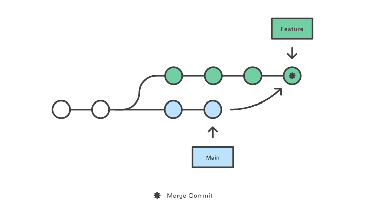
#### Rebase
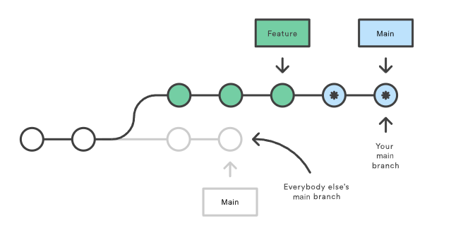
#### Commit History
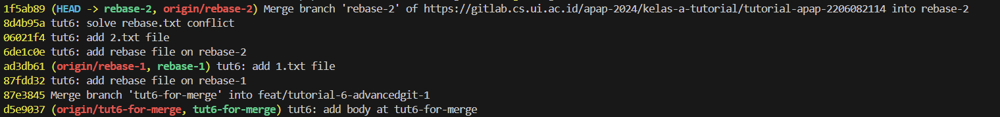
**Git Merge:**
Git Merge akan membuat commit baru yang disebut sebagai “merge commit” yang menggabungkan kedua branch tanpa mengubah commit history dari branch mana pun. Git Merge bersifat *non-destructive*, artinya commit history dari kedua branch tetap utuh. Branch feature akan menampilkan semua commit dari branch main tanpa mengubah atau memindahkan commit yang sudah ada.
Contoh: Commit 1f5ab89 adalah contoh merge commit. Ini menunjukkan bahwa branch rebase-2 telah digabungkan ke branch utama (dengan membuat merge commit), tanpa mengubah urutan commit yang sudah ada di kedua branch.

**Git Rebase:**
Git Rebase akan mengambil commit dari satu branch dan “memindahkannya” di atas commit terbaru dari branch target. Ini menciptakan commit baru dari setiap commit di branch sumber, yang menyebabkan tampilan history yang lebih bersih dan linear. Penggunaan rebase akan menghasilkan history dengan semua commit pada branch sumber dibuat setelah commit terbaru pada branch target.
Contoh: Proses rebase memiliki commit 8d4b95a dan 06021f4 yang berada di atas commit dari branch rebase-1 tanpa ada merge commit. Hal ini menunjukkan bahwa rebase berhasil membuat commit yang linier tanpa perlu ada “merge commit.”

Sumber: [Atlassian Merge vs Rebase](https://www.atlassian.com/git/tutorials/merging-vs-rebasing)

5. **Mengapa hal pada langkah no 4 bisa terjadi? Mengapa git stash menjadi solusinya? (halaman 20)**
Gagal pindah branch disebabkan karena adanya perubahan yang belum di-*commit*. Apabila pemindahan branch tetap dilakukan, perubahan yang sudah ada di branch awal akan di-*overwrite* oleh branch tujuan pindah. Maka dari itu, git mencegah hilangnya perubahan yang sudah kita lakukan dengan mengagalkan checkout atau pindah branch.
`Git stash` adalah solusi dalam hal ini untuk menyimpan perubahan sementara tanpa perlu melakukan commit. 
Perintah `git stash` akan menyimpan perubahan yang ada (baik yang sudah ditambahkan ke staging area maupun yang belum) ke dalam tumpukan (*stash stack*) yang dapat kita ambil kembali nanti. Dengan begitu, *working directory* akan menjadi bersih sehingga kita bisa berpindah branch tanpa konflik atau kehilangan perubahan. Setelah berpindah branch dan melakukan apa yang diperlukan, kita bisa mengambil kembali perubahan yang disimpan di branch awal dengan menggunakan `git stash pop`.
Sumber: 
[Git Checkout Documentation](https://git-scm.com/docs/git-checkout)
[Git Stash Documentation](https://git-scm.com/docs/git-stash)

6. **Sebutkan dan jelaskan tiga tipe dari Git Reset!**
`--hard`
Mengubah HEAD, index, dan working tree sesuai commit target. Hal ini akan menghapus semua perubahan yang ada. Mode ini berguna jika ingin membatalkan commit dan menghapus semua perubahan di dalam working tree.
`--soft` 
Mengubah HEAD ke commit target tetapi tidak mengubah index atau working tree. Digunakan untuk membatalkan commit namun mempertahankan perubahan sebagai staged (siap untuk di-commit ulang).
`--mixed` (default) 
Mengubah HEAD dan index ke commit target, namun tetap mempertahankan perubahan di working tree. Mode ini berguna jika kita ingin membatalkan commit dan perubahan staged, sehingga perubahan kembali ke status unstaged.
Sumber: [Git Reset Documentation](https://git-scm.com/docs/git-reset)

7. **Apa itu git revert? Apa perbedaannya dengan git reset?**
`git revert`
Membuat commit baru yang membalikkan atau membatalkan perubahan dari commit yang ditentukan. Ini menjaga log commit asli tetap utuh dan menambah commit baru di atasnya. `git revert` cocok digunakan ketika ingin membatalkan perubahan dari commit tertentu tanpa menghapus commit dari log commit.
`git reset`
Menghapus atau mengubah log commit. Jika menggunakan git reset --hard, perintah ini akan memindahkan posisi branch ke commit tertentu dan menghapus semua commit yang berada di antara commit tersebut dan posisi awal HEAD. Ini dapat merusak log di repositori bersama karena menghapus commit yang sudah ada di log. Digunakan ketika ingin mengatur ulang posisi branch, biasanya di lingkungan pengembangan lokal dan belum di-*push*.
Sumber: [Git Revert Documentation](https://git-scm.com/docs/git-revert)

8. **Buatlah grafik yang menggambarkan alur commit pada bagian Git Flow and Branching ini serta jelaskan! Grafik dapat berupa tulis tangan maupun menggunakan software.**
Grafik flow, bagian atas adalah flow sebelum rebase dan bagian bawah adalah setelah rebase.
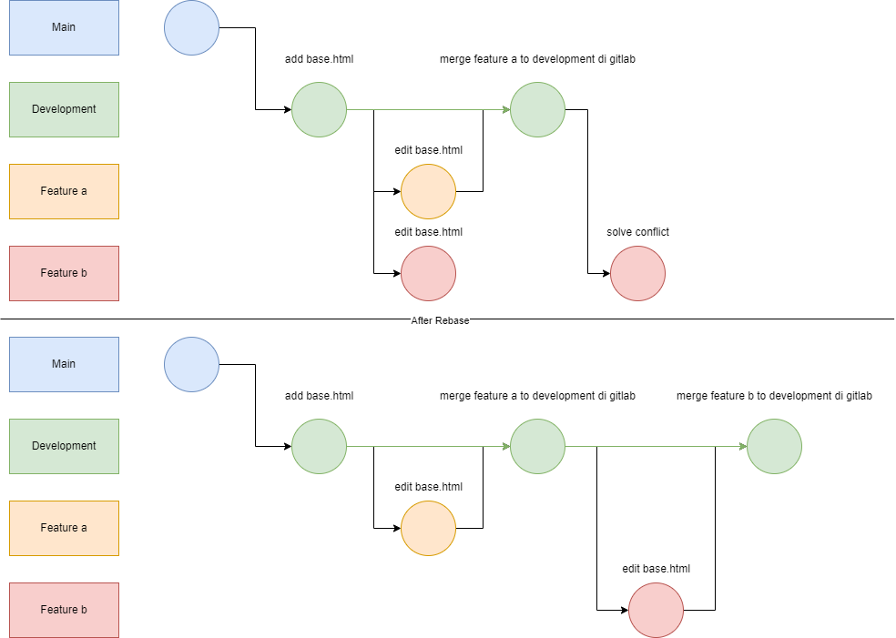
#### Langkah-Langkah Git Flow
- Membuat branch `development`
Buat branch `development` dari branch `main`:
- Membuat direktori dan file Baru pada Branch `development` kemudian commit
Membuat direktori baru bernama *git-flow* dan buat file base.html di branch `development`. Perubahan kemudian di-*add* dan di-*commit* dengan nama `tut6: add base.html` dan di push ke branch `development`.
- Membuat branch `feature-a` dari branch `development`
Membuat branch baru bernama `feature-a` dari branch `development` untuk modifikasi`base.html`. Perubahan kemudian di-*add* dan di-*commit* dengan nama `tut6: edit base.html` dan di push ke branch `feature-a`.
- Merge branch `feature-a` ke branch `development`
Kedua branch di-*merge* melalui gitlab sehingga branch `development` akan memiliki hasil modifikasi `base.html` yang sudah dilakukan di branch `feature-a`.
- Membuat branch `feature-b` dari branch `development` tetapi belum pull hasil merge branch `feature-a` dan `development` di gitlab.
Membuat branch baru bernama `feature-b` dari branch `development` untuk modifikasi`base.html`. Pembuatan branch dilakukan sebelum pull dari hasil merge branch`feature-a` ke branch `development` sehingga `base.html` di branch `feature-b` masih kosong. `base.html` kemudian dimodifikasi dan hasil modifikasi di-*add* dan di-*commit* dengan nama `tut6: edit base.html` serta di push ke branch `feature-b`.
- Rebase branch `feature-b` dari branch d`evelopment`
Melakukan rebase branch `feature-b` yang ternyata ada konflik akibat ada perubahan di `base.html` baik dari sisi `feature-b` maupun hasil merge `feature-a` ke `development`. Konflik diselesaikan dengan opsi *Accept Both Changes* dan di-*add* serta di-*commit* dengan nama `feat: solved conflict base.html` Rebase kemudian dilanjutkan (`--continue`) dan di push hasil rebase ke branch `feature-b`
- Merge branch `feature-b` ke branch `development`
Kedua branch di-*merge* melalui gitlab sehingga branch `development` akan memiliki hasil modifikasi `base.html` dari `feature-b` yang sudah di-*rebase* dengan commit dari branch `feature-a`.
9. **Apa kegunaan dari langkah di atas?**
**Membuat HTTP Header Manager:**
HTTP Header Manager berfungsi untuk menambahkan atau mengelola header HTTP yang akan dikirim bersama request HTTP selama pengujian di JMeter. Dalam konteks pengujian aplikasi web atau API, header adalah bagian penting yang memberikan informasi tambahan kepada server.
**Menambahkan Header content-type dengan Nilai application/json:**
Header Content-Type menunjukkan kepada server format data yang dikirimkan dalam permintaan HTTP. Dengan mengatur nilai sebagai application/json, kita memberi tahu server bahwa data yang dikirimkan adalah dalam format JSON.
Jika Content-Type tidak diatur, server mungkin tidak dapat memproses permintaan dengan benar atau bahkan bisa memberikan respons error.
Sumber: [Blazemeter HTTP Header Manager](https://www.blazemeter.com/blog/http-header-manager)
10. **Apa itu JSON Extractor? Sebutkan semua kegunaannya di Test Plan ini!**
JSON Extractor adalah fitur di dalam Apache JMeter yang digunakan untuk mengekstrak nilai dari JSON response yang diterima setelah melakukan HTTP Request. JSON Extractor menggunakan JSON Path expressions untuk menemukan data spesifik dalam response dan menyimpan hasilnya dalam variabel JMeter. Variabel ini kemudian dapat digunakan dalam komponen lain di test plan, seperti Assertions atau dalam HTTP Request lainnya.
Dalam kasus ini, JSON Extractor digunakan untuk mengambil idProyek dari proyek yang baru saja dibuat dan disimpan dalam bentuk $.data.id. idProyek nantinya akan digunakan dalam JSON Assertion untuk test *update* proyek tersebut.
Sumber: [Blazemeter JSON Extractor](https://www.blazemeter.com/blog/json-extractor)
11. **Apa itu Assertions dalam JMeter? Sebutkan contoh 3 Assertions dan kegunaannya!**
Assertions dalam JMeter adalah komponen yang digunakan untuk memvalidasi respon dari server berdasarkan kriteria yang ditetapkan oleh pengguna. Assertions mengevaluasi respon dari server dan menentukan apakah hasil tes tersebut lulus atau gagal berdasarkan kondisi yang diberikan.
Contoh Assertion:
- Response Assertion:
Response Assertion digunakan untuk memeriksa apakah teks respon, kode respon, atau header respon mengandung, cocok, atau sama dengan pola yang ditentukan. Misalnya, Response Assertion dapat digunakan untuk memastikan bahwa respon dari server mengandung kata tertentu atau mengembalikan kode status HTTP yang diharapkan seperti 200 OK.
- Duration Assertion:
Duration Assertion digunakan untuk memastikan bahwa request yang dikirim ke server diolah dalam batas waktu yang ditentukan. Jika waktu respons melebihi batas yang ditentukan, maka assertion akan gagal yang menandakan bahwa performa server mungkin tidak memadai.
- Size Assertion:
Size Assertion digunakan untuk memverifikasi ukuran respon dalam bytes. Ini berguna untuk memastikan bahwa ukuran respon sesuai dengan yang diharapkan, baik itu lebih besar, lebih kecil, sama dengan, atau tidak sama dengan ukuran tertentu yang ditentukan. Hal ini digunakan untuk memastikan ukuran respon yang dikirim tidak berlebih atau tidak kurang.
Sumber: [Blazemeter JSON Assertions](https://www.blazemeter.com/blog/jmeter-assertions)
12. **Apa itu Number of Threads dan Ramp-up Period? Apa hubungan antar keduanya?**
**Number of Threads**
Number of Threads merujuk pada jumlah total *virtual users* atau threads yang akan digunakan dalam pengujian. Setiap thread mewakili satu pengguna yang meniru interaksi dengan sistem atau aplikasi yang sedang diuji.
**Ramp-up Period**
Ramp-up Period adalah durasi waktu yang diperlukan untuk semua threads yang diatur dalam *Number of Threads* untuk diaktifkan. Misalnya, jika ada 100 threads dan ramp-up period adalah 100 detik, maka JMeter akan secara bertahap memulai masing-masing thread dalam kurun waktu tersebut, dengan kecepatan kira-kira satu thread per detik.
**Contoh hubungan**
Number of Threads (Pengguna): 500 
Ramp-up Period: 100 detik 
      - Steps: 5
      - Setiap 20 detik (yaitu 100 detik dibagi 5 langkah), kumpulan pengguna baru akan dimulai.
      - Setiap langkah akan memperkenalkan 100 pengguna (500 pengguna dibagi 5 langkah).
      - Artinya JMeter memulai 5 pengguna setiap detik untuk setiap langkah karena 20 detik dibagi 100 pengguna menghasilkan 0,2 detik per pengguna.

      Kombinasi antara jumlah threads dan durasi ramp-up period memungkinkan pengujian yang lebih fleksibel dan mendalam terhadap aplikasi, membantu dalam mengidentifikasi masalah performa di bawah berbagai kondisi beban. Ini juga membantu dalam mengoptimalkan sumber daya server untuk mengelola beban pengguna dalam produksi secara lebih efektif.
Sumber: [Blazemeter Load Testing](https://loadfocus.com/docs/guides/load-testing/what-is-ramp-up-time-in-load-testing)
13. **Gunakan angka 1000 untuk Number of Threads dan 100 untuk Ramp-up period. Jalankan Test Plan dengan konfigurasi tersebut. Kemudian, perhatikan Summary Report, View Result Tree, Graph Result, dan Assertion Result. Buatlah penjelasan minimal 2 paragraf untuk menjelaskan temuan menarik kalian terhadap hasil-hasil tersebut. Sertakan screenshot dari keempat result tersebut. Sertakan juga info mengenai prosesor, RAM, dan penggunaan hardisk HDD atau SSD dari perangkat Anda. (Jika perangkat Anda tidak kuat dengan angka konfigurasi tersebut, silakan turunkan angkanya).**
**Laptop Specification**
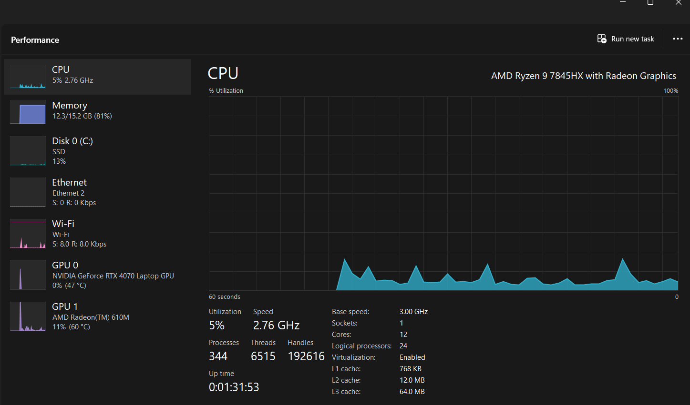
CPU = Ryzen 7845HX, 12 core, 24 thread, Base clock 3 GHz, Max boost clock 5.2 GHz
SSD = 1TB, Sequential Read 4000 MB/S Sequential Write 3000 MB/S
RAM = 16 gb, DDR 5 4800Mhz
**Summary Report**
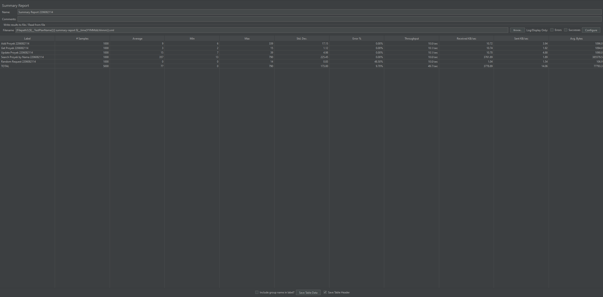
***Summary Report*** menunjukkan tingkat kesuksesan dan kegagalan dari permintaan yang dikirim. Berdasarkan *summary report*, saya menemukan ada total 5000 samples atau hasil test dengan error rate sebesar 9.70%. Error rate ini terfokus pada satu test tertentu, yaitu Random Request 2206082114 dengan error rate yang signifikan sebesar 48.50% karena kesuksesan request ini adalah random. 
Throughput juga mencapai 49.7 *requests per second* yang mengindikasikan bahwa sistem atau laptop saya mampu melakukan request dan mengirim respon dengan cukup cepat. Hal ini juga menandakan request atau respon yang diterima masih dalam skala kecil. *Received KB/sec* yang bernilai 3778.89/sec lebih tinggi dibandingkan *Send KB/sec* yang juga menunjukkan bahwa ukuran response yang diterima lebih besar dibandingkan ukuran request yang dikirim (lebih banyak GET daripada POST atau PUT).
**View Result Tree**
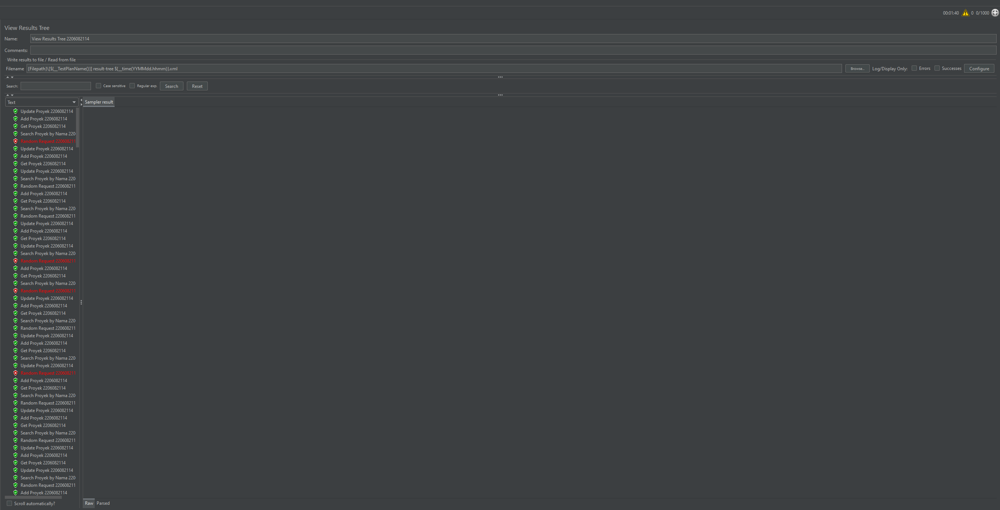
***View Results Tree*** dapat melihat detail dari setiap request yang dibuat, termasuk status sukses atau gagal. *View Result Tree* memungkinkan melihat request dan hasil response dari sistem yang sangat membantu dalam menganalisis request yang mana yang mengalami kegagalan dan memeriksa detail respons untuk menentukan penyebabnya. Dalam kasus pengerjaan tutorial, *View Result Tree* saya gunakan untuk mengetahui kesalahan pada bagian Update Proyek 2206082114 yang tidak berjalan akibat kesalahan penulisan (kurang $ di depan {idProyek}).
**Graph Result**
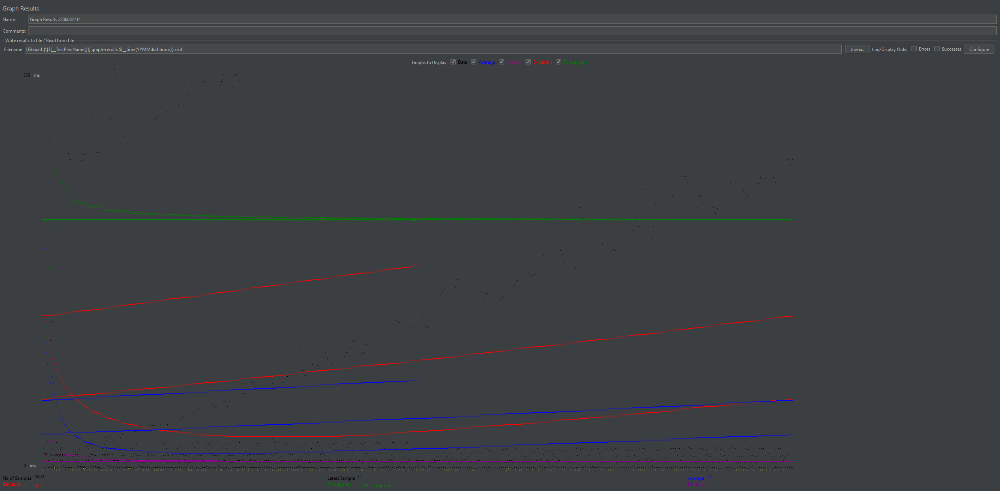
***Grafik*** menampilkan waktu respon terhadap waktu dimana kita bisa melihat ada peningkatan waktu respon yang konsisten dan beberapa outliers. Garis merah dan biru yang terus meningkat menunjukkan akumulasi waktu latensi seiring bertambahnya jumlah users. Ini menjadi indikasi bahwa sistem mulai terbebani seiring bertambahnya jumlah request yang dijalankan secara bersamaan. Garis hijau (*throughput*) yang relatif datar mengindikasikan throughput yang konsisten, menunjukkan bahwa meskipun ada peningkatan waktu respons, server masih mampu memproses requests dengan throughput yang stabil.
**Assertion Result**
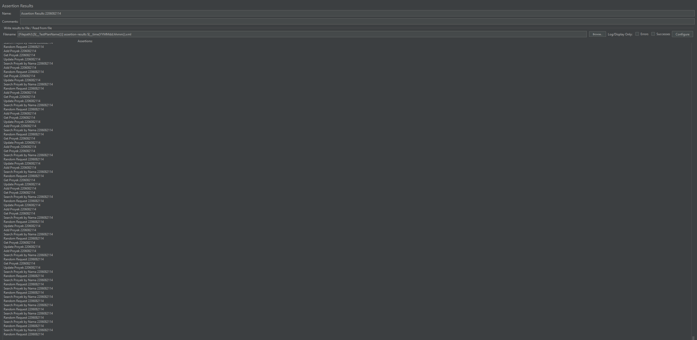
***Assertion Results*** menampilkan hasil dari assertions yang dilakukan selama testing. 
14. **Sembari menjalankan Test Plan, perhatikan pergerakan grafik pada JConsole. Buatlah penjelasan minimal 2 paragraf untuk menjelaskan temuan menarik kalian terhadap hasil-hasil tersebut. Sertakan screenshot dari grafik-grafik tersebut.**
**JConsole**
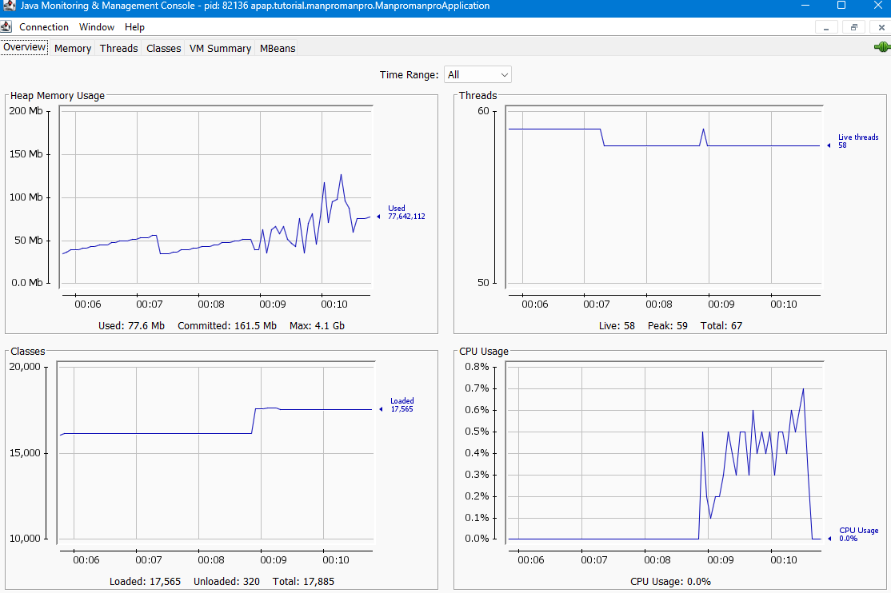
Dari hasil JConsole, terdapat beberapa hal menarik yang saya temukan. Pertama, ***Heap Memory Usage*** menunjukkan fluktuasi yang mencolok selama periode pengujian. Grafik menunjukkan penggunaan memori yang bergerak dari sekitar 50 MB dan mencapai hampir 100 MB pada beberapa titik waktu. Kenaikan yang cepat dan signifikan pada penggunaan memori dapat menunjukkan alokasi objek yang besar secara tiba-tiba, yang disebabkan oleh pengujian. Selain itu, pola naik turun yang terlihat menandakan aktivitas garbage collection yang terjadi, menunjukkan bahwa JVM sedang aktif dalam mengelola memori yang digunakan.
Kedua, ***CPU Usage*** yang terlihat pada grafik cenderung sangat rendah, dengan puncak sesekali yang tidak lebih dari 0.8%. Ini mengindikasikan bahwa pengujian tidak banyak menggunakan CPU. Lonjakan pertama pada *CPU Usage* juga menunjukkan mulainya pengujian.
Ketiga, **Classes** menunjukkan jumlah kelas yang dimuat selama periode pengujian. Lonjakan pertama pada **Classes* menunjukkan mulainya pengujian. Ini menunjukkan bahwa ada pemuatan kelas baru saat pengujian dimulai atau ada kelas yang dibuang (unloaded) dan kemudian dimuat kembali. Total kelas yang dimuat berjumlah 17,565, sementara total kelas yang di-*unload* sebesar 320.
Terakhir, ***Thread Management*** menunjukkan jumlah thread yang stabil dengan sedikit variasi. Grafik menunjukkan jumlah thread aktif yang bertahan di sekitar angka 58 dengan puncak 59 dengan lonjakan kedua sebagai tanda awal mula pengujian. Peningkatan dan penurunan jumlah thread dalam grafik mencerminkan aktivitas sistem yang melakukan pemrosesan paralel atau *concurrent*.
Sumber: [ITUOnline JConsole](https://www.ituonline.com/tech-definitions/what-is-jconsole/)

15. **Apa itu Load Testing? Buatlah kesimpulan dari pengerjaan tutorial JMeter & JConsole ini.**
**Load testing** adalah pengujian yang dilakukan untuk menentukan atau memvalidasi kinerja suatu aplikasi atau sistem dengan mensimulasikan jumlah pengguna yang besar (beban kerja yang besar). Tujuan dari *load testing* adalah untuk mengidentifikasi batas kapasitas aplikasi dan untuk memastikan bahwa aplikasi masih dapat beroperasi secara efisien di bawah beban kerja tinggi. Melalui JMeter, berbagai pengujian dapat dilakukan, baik dari sisi metode request, pengaturan *header*, jumlah virtualisasi *user* dan lainnya. Bersamaan dengan pengujian, JConsole juga dapat digunakan untuk memantau kinerja dari sistem untuk mengetahui apabila ada anomali dan batas dari sistem. Pengujian - pengujian ini akan membantu dalam mengidentifikasi masalah - masalah seperti kebocoran memori, batas throughput, dan kegagalan untuk diperbaiki sebelum aplikasi atau sistem diimplementasikan secara luas.
### Apa yang belum saya pahami
- [x] Kenapa saya menggunakan Lombok? 
   Untuk menggunakan berbagai metode dari library Lombok tanpa harus membuat kode berlebih.
- [ ] Cara testing?
- [x] Apakah if else di html itu optimal?
   Bisa, tetapi lebih baik apabila tidak ada.
- [x] Apakah merge request harus diperbarui setiap push baru?
   Push ke dalam branch yang ingin di merge secara otomatis masuk ke dalam merge request.

## Tutorial 7
### Apa yang telah saya pelajari hari ini
1. Cara menghubungkan Vue js dengan SpringBoot serta cara menggunakannya.

### Pertanyaan
1. **Jelaskan apa saja maksud dari pilihan konfigurasi pada awal inisialiasi proyek vue!**
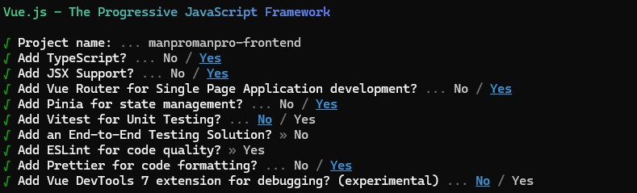
**Project Name**: Ini adalah nama proyek.
**Add TypeScript**: menggunakan TypeScript atau superset dari JavaScript yang menambahkan tipe statis. TypeScript membantu dalam mengetahui kesalahan sejak awal dengan memungkinkan pemeriksaan tipe.
**Add JSX Support**: menggunakan JSX (JavaScript XML) yang merupakan syntax tambahan yang memungkinkan menulis komponen dalam bentuk seperti syntax HTML di JavaScript (seperti React js).
**Add Vue Router for Single Page Application development**: menggunakan Vue Router atau library bawaan Vue untuk membuat aplikasi *single-page* (SPA). Ini memungkinkan pengaturan atau *routing* tiap halaman yang bisa dilakukan dalam satu file.
**Add Pinia for state management**: menggunakan Pinia atau *state management library* resmi untuk Vue untuk mengelola dan menyimpan data aplikasi di satu tempat yang bisa diakses oleh berbagai komponen.
**Add Vitest for Unit Testing**: tidak menggunakan Vitest atau framework testing untuk JavaScript. Hal ini mungkin dilakukan karena tidak ada rencana pengujian vue untuk proyek.
**Add an End-to-End Testing Solution**: tidak menambahkan alat pengujian **end-to-end** (E2E), yaitu pengujian yang melibatkan seluruh aplikasi dari awal hingga akhir. Hal ini mungkin dilakukan karena tidak ada rencana pengujian vue untuk proyek.
**Add ESLint for code quality**: menggunakan ESLint atau alat untuk mendeteksi dan memperbaiki masalah pada kode, seperti gaya penulisan dan potensi kesalahan. Menjaga kualitas kode dengan ESLint memudahkan pemeliharaan kode dan membantu konsistensi kode antar pengembang.
**Add Prettier for code formatting**: menggunakan Prettier atau formatter kode otomatis untuk membantu memformat kode agar lebih jelas dan mudah untuk dibaca.
**Add Vue DevTools 7 extension for debugging (experimental)**: tidak menggunakan Vue DevTools 7 atau ekstensi untuk melihat status aplikasi Vue, state komponen, dan debugging.
Sumber: 
[Vue js Guide](https://vuejs.org/guide/)
[JSX docs](https://legacy.reactjs.org/docs/introducing-jsx.html)
[Vitest Guide](https://vitest.dev/guide/)
[ESLint docs](https://eslint.org/docs/latest/)
[Prettier](https://prettier.io)
2. **Apa itu vite?**
**Vite** adalah *build tool* yang dikembangkan oleh Evan You, pembuat Vue.js, untuk meningkatkan efisiensi pengembangan aplikasi frontend. 
Vite memiliki dua fungsi utama:
- Menyediakan server pengembangan yang sangat cepat dengan fitur *hot module replacement* (HMR) yang memungkinkan pengembang melihat perubahan kode secara langsung di browser tanpa memuat ulang seluruh halaman.
- Vite melakukan bundling dan optimalisasi kode yang menghasilkan bundle yang lebih kecil untuk di-*deploy*.
**Apakah Kita Bisa Menggunakan Vue Tanpa Vite?**
**Ya**, Vue bisa digunakan tanpa Vite. Sebelum Vite populer, Vue biasanya dikonfigurasi menggunakan Vue CLI atau Webpack secara langsung.
Sumber: 
[Vue js Tooling](https://vuejs.org/guide/scaling-up/tooling)
[Vite guide](https://vite.dev/guide/)
3. **Jelaskan masing-masing fungsi dari assets, components, router, stores, dan view pada proyek aplikasi Vue JS!**
**assets**
Folder assets digunakan untuk menyimpan file static seperti gambar, icon, file CSS global, dan resource lainnya yang tidak berubah untuk diimport dan digunakan di dalam proyek. Dalam manpromanpro-frontend, assets berisi `index.css` yang berisi import style css dari Tailwind css dan `logo.svg` untuk logo.
**components**
Folder components berisi komponen - komponen Vue yang dapat digunakan kembali di berbagai bagian aplikasi. Komponen adalah unit kecil dari aplikasi yang memiliki logika, tampilan, dan gaya tersendiri. Komponen biasanya berbentuk file .vue yang berisi tiga bagian: template, script, dan style. Setiap komponen memiliki satu tanggung jawab tertentu, seperti Navbar, Footer, atau Button. Komponen di dalam folder ini bersifat *reusable* yang berarti dapat digunakan kembali di berbagai tempat dalam aplikasi.
**router**
Folder router berisi pengaturan rute (*routing*) untuk aplikasi yang menggunakan Vue Router. File dalam folder ini mendefinisikan setiap rute atau halaman, termasuk komponen mana yang akan ditampilkan untuk setiap jalur URL.
**stores**
Folder stores berisi *manajemen state global aplikasi* dengan menggunakan Pinia. State di dalam stores memungkinkan pengelolaan data aplikasi di satu tempat pusat sehingga lebih mudah untuk diperbarui dan diakses oleh berbagai komponen. Dalam manpromanpro-frontend, stores digunakan untuk pengolahan data untuk viewall, add, view, update, dan delete.
**views**
Folder views berisi halaman utama untuk rute aplikasi, seperti AboutView, HomeView, CreateProyekView, dan lainnya. Setiap file di views adalah sebuah komponen yang mewakili halaman atau tampilan secara lengkap, berbeda dengan folder components yang berisi komponen yang *reusable*, komponen di folder views biasanya hanya digunakan di satu rute tertentu. Oleh karena itu, setiap file di views umumnya dihubungkan langsung ke satu rute melalui router.
[Vue js Guide](https://vuejs.org/guide/)
4. **Kenapa agar Vue JS dapat mengakses REST API yang ada pada Spring Boot, kalian harus menambahkan konfigurasi CORS terlebih dahulu?**
**Konfigurasi CORS (Cross-Origin Resource Sharing)** ditambahkan agar aplikasi Vue.js yang berjalan di `http://localhost:5173` dapat mengakses REST API yang disediakan oleh aplikasi SpringBoot dari `http://localhost:8080`. Tanpa konfigurasi ini, permintaan dari Vue.js ke REST API kemungkinan akan ditolak karena kebijakan keamanan yang diterapkan oleh browser yang disebut **Same-Origin Policy**.
**Same-Origin Policy** adalah kebijakan keamanan pada browser yang membatasi bagaimana dokumen atau script yang dimuat dari satu origin dapat berinteraksi dengan resource dari origin lain. Secara default, browser memblokir permintaan yang berasal dari domain yang berbeda.
**CORS** adalah mekanisme yang memungkinkan server untuk mengizinkan akses dari domain lain dengan mengatur respons HTTP tertentu. Dengan mengaktifkan CORS, server dapat mengontrol origin, metode, dan header yang diperbolehkan sehingga aplikasi web yang berjalan di domain berbeda dapat mengakses resource.
Sumber: [SpringBoot CORS](https://docs.spring.io/spring-framework/reference/web/webmvc-cors.html)
5. **Jelaskan apa kegunaan interface pada typescript dan apa perbedaannya dengan types serta kapan harus menggunakan yang mana!**
Dalam TypeScript, **interface** adalah struktur yang digunakan untuk mendefinisikan tipe khusus dengan menetapkan bentuk dan tipe dari data yang akan digunakan dalam program (semacam DTO). interface membantu dalam menjaga konsistensi struktur data, terutama dalam aplikasi berskala besar dengan banyak komponen dan tipe data yang kompleks. **interface** juga memungkinkan TypeScript memberikan saran otomatis (*autocomplete*) dan memvalidasi tipe saat coding. Misalnya jika menggunakan ProjectInterface atau ProjectRequestInterface dalam kode, editor akan membantu dengan *autocompletion* dan peringatan apabila ada kesalahan dalam penggunaan struktur data tersebut. Adanya interface juga mempermudah refactoring dan maintenance serta menghindari penggunaan tipe implicit.
**Perbedaan antara interface dan types**
**Extensibility**:
interface mendukung extends secara alami sehingga mudah untuk membuat interface baru dengan mewarisi properti dari interface lain.
type juga bisa digabungkan dengan tipe lain menggunakan intersection types (&), tetapi tidak semudah interface.
**Declaration Merging**:
interface mendukung *declaration merging* yang berarti jika tidak sengaja mendefinisikan dua interface dengan nama yang sama, TypeScript akan menggabungkannya.
type tidak mendukung fitur ini sehingga jika ada dua type dengan nama yang sama, maka akan terjadi error.
Contoh merging:
```ts
interface Person {
  name: string;
}
interface Person {
  age: number;
}
const person: Person = { name: "John", age: 30 };
```
**Kapan Harus Menggunakan interface atau type?**
interface digunakan saat ingin mendefinisikan struktur untuk sebuah objek yang bisa diperluas atau digabungkan. Sementara itu, type digunakan jika membutuhkan tipe yang lebih kompleks, seperti union types atau jika tipe yang dibuat tidak perlu *extend* atau merging.
Sumber:
[TypeScript Interfaces](https://www.typescriptlang.org/docs/handbook/interfaces.html)
[TypeScript Advanced Types](https://www.typescriptlang.org/docs/handbook/advanced-types.html)

## Tutorial 8
### Apa yang telah saya pelajari hari ini
1. Penggunaan authentication di dalam Springboot menggunakan JwtToken.
2. Filter berdasarkan role

### Pertanyaan
1. **Apa perbedaan antara encryption dan hashing? Mana yang lebih baik untuk penyimpanan password?**

| Aspek                   | Encryption                                                                                 | Hashing                                                                   |   |   |
|-------------------------|--------------------------------------------------------------------------------------------|---------------------------------------------------------------------------|---|---|
| Definisi                | Proses dua arah untuk mengamankan data dengan encoding (enkripsi) dan decoding (dekripsi). | Proses satu arah untuk mengubah data menjadi hash value (message digest). |   |   |
| Tujuan                  | Menjaga kerahasiaan data.                                                                  | Menjaga integritas data.                                                  |   |   |
| Kembalikan ke Plaintext | Bisa didekripsi kembali ke bentuk asli menggunakan kunci.                                  | Tidak bisa dikembalikan ke bentuk asli (irreversible).                    |   |   |
| Panjang Output          | Output memiliki panjang variabel, tergantung pada algoritma dan data asli.                 | Output memiliki panjang tetap, terlepas dari panjang input.               |   |   |
| Contoh Algoritma        | AES, RSA, Triple DES.                                                                      | MD5, SHA-256, Tiger, Whirlpool.                                           |   |   |
| Penggunaan Umum         | Melindungi data yang ditransfer atau disimpan (misalnya, email, file, komunikasi).         | Penyimpanan password, verifikasi data, dan integritas file.               |   |   |

Berdasarkan perbedaan tersebut, Hashing adalah pilihan yang lebih baik dalam menyimpan password. Hal ini dikarenakan beberapa benefit lebih yang diberikan oleh hashing, seperti keamanan satu arah dan dapat digunakan bersamaan dengan Salting.

Sumber: [ClickSSL Hashing vs Encryption](https://www.clickssl.net/blog/difference-between-hashing-vs-encryption#:~:text=Hashing%20vs%20Encryption%20–%20Hashing%20refers,the%20reach%20of%20third%20parties.)

2. **Apa yang membuat spring meredirect pengguna ke /login ketika pertama kali membuka localhost:8080?**
Di dalam `WebSecurityConfig.java`, terdapat pengolahan request pengguna untuk memfilter akses halaman di dalam aplikasi. Hal ini membuat pengguna hanya dapat mengakses halaman tertentu sesuai dengan rolenya kalau sudah terautentikasi. Sebelum terauntetikasi, pengguna akan di-*redirect* ke bagian login. Berikut adalah dua kode utama yang digunakan agar pengguna *redirect* ke `/login` saat pertama kali membuka `localhost:8080`.
```java
.authorizeHttpRequests (requests -> requests
      .requestMatchers (new AntPathRequestMatcher("/css/**")).permitAll() 
      .requestMatchers (new AntPathRequestMatcher("/js/**")).permitAll()
      .requestMatchers("/user/add").hasAuthority("Admin") 
      .requestMatchers("/developer/**", "/pekerja/**").hasAnyAuthority("Admin", "HR") 
      .requestMatchers("/proyek/**").hasAnyAuthority("Admin", "PM") 
      .anyRequest().authenticated()
) 
```
```java
.formLogin((form) -> form
      .loginPage("/login")
      .permitAll()
      .defaultSuccessUrl("/")
)
```
Kode tersebut akan membuat user di-*redirect* ke halaman `/login` untuk autentikasi terlebih dahulu. Setelah terauntetikasi, user baru akan bisa mengakes halaman - halaman lainnya sesuai filter role.

3. **Kapan method loadUserByUsername ini dipanggil?**
Method `loadUserByUsername` ini dipanggil di `JwtTokenFilter.java` untuk mengambil detail pengguna (*role*) yang sesuai dengan nama pengguna (*username*) yang diekstrak dari token JWT. Hal ini dilakukan untuk kemudian untuk melakukan authorisasi berdasarkan role pengguna. Melalui informasi *role* yang dikembalikan method, role ini digunakan untuk menentukan apakah pengguna memiliki hak akses yang sesuai untuk endpoint tertentu.
```java
.requestMatchers("/api/user/add**").hasAuthority("Admin")
```

4. **Apa makna dari anotasi order serta mengapa jwtFilterChain ada di order 1 dan webFilterChain ada di order 2?**
Anotasi `@Order` digunakan untuk menentukan prioritas eksekusi *Spring Security Filter Chains* ketika ada lebih dari satu konfigurasi filter dalam aplikasi.
Filter dengan `@Order` bernilai lebih rendah (misalnya, 1) akan dievaluasi terlebih dahulu.
Filter dengan `@Order` bernilai lebih tinggi (misalnya, 2, 3, dst.) akan dievaluasi setelahnya.
**Mengapa jwtFilterChain Ada di Order 1 dan webFilterChain di Order 2?**
- jwtFilterChain di Order 1
jwtFilterChain menangani endpoint berbasis REST API yang dimulai dengan `/api/**`.
Karena REST API tidak menggunakan sesi (*stateless*), filter ini perlu dievaluasi sebelum filter lain untuk memastikan bahwa semua permintaan ke `/api/**` dapat diotorisasi atau ditolak berdasarkan token JWT. Filter ini juga mengatur kebijakan `SessionCreationPolicy.STATELESS`, yang memaksa aplikasi untuk tidak menyimpan sesi pengguna.
- webFilterChain di Order 2
webFilterChain menangani endpoint *non-API* yang menggunakan form login dan sesi berbasis *stateful*.
Halaman web (*non-API*) bergantung pada *session-based authentication* dan menggunakan mekanisme seperti login form (/login) dan logout (/logout). Filter ini tidak memerlukan token JWT dan dapat menggunakan autentikasi berbasis sesi yang memungkinkan pengguna tetap terautentikasi selama sesi mereka berlaku.
Menempatkan ini di @Order(2) memastikan bahwa filter untuk REST API (jwtFilterChain) dievaluasi terlebih dahulu, sehingga endpoint /api/** tidak ditangani oleh filter berbasis sesi secara tidak sengaja.

5. **Apa fungsi digunakannya method exceptionHandling pada jwtFilterChain? Jelaskan untuk masing-masing exception yang ditangani, yaitu autheticationEntryPoint dan accessDeniedHandler**
Method `exceptionHandling` pada `jwtFilterChain` digunakan untuk menangani exception yang mungkin terjadi selama proses autentikasi atau otorisasi di Spring Security.
- **authenticationEntryPoint**
Exception ini terjadi ketika pengguna mencoba mengakses endpoint yang membutuhkan autentikasi tetapi pengguna tidak terautentikasi (belum login atau token JWT tidak valid).
Apabila terjadi exception, maka kode akan mengembalikan respons HTTP dengan kode status 401 Unauthorized dengan bentuk response seperti berikut.
```json
{
  "status": 401,
  "error": "Unauthorized",
  "message": "Full authentication is required to access this resource"
}
```
- **accessDeniedHandler**
Exception ini terjadi ketika pengguna sudah terautentikasi, tetapi tidak memiliki izin yang cukup untuk mengakses endpoint tertentu. Pengguna mengirimkan token JWT yang valid, tetapi *role* tidak sesuai dengan otoritas yang diperlukan untuk mengakses endpoint. Berikut adalah response yang diberikan apabila terjadi exception.
```http
HTTP/1.1 403 Forbidden
Content-Type: text/plain

Anda Tidak Memiliki Akses ke Endpoint Ini!
```

### Apa yang belum saya pahami
- [x] Kenapa saya menggunakan Lombok? 
   Untuk menggunakan berbagai metode dari library Lombok tanpa harus membuat kode berlebih.
- [ ] Cara testing?
- [x] Apakah if else di html itu optimal?
   Bisa, tetapi lebih baik apabila tidak ada.
- [x] Apakah merge request harus diperbarui setiap push baru?
   Push ke dalam branch yang ingin di merge secara otomatis masuk ke dalam merge request.